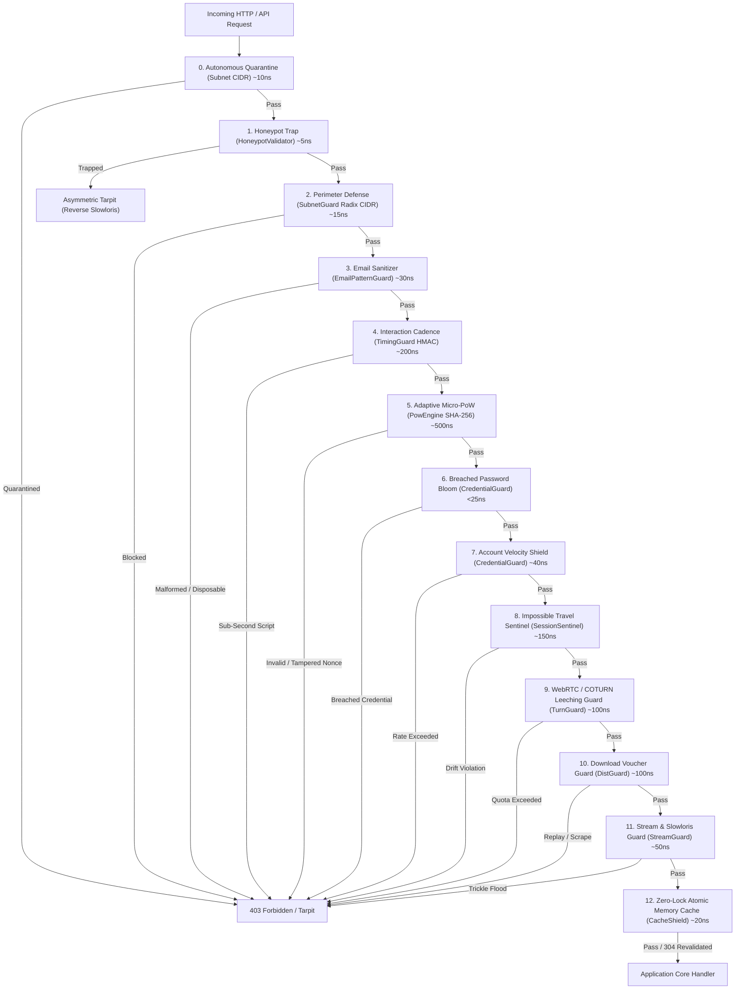

# phylax (φύλαξ)

[](https://github.com/xuoxod/phylax/actions/workflows/ci.yml)
[](LICENSE-MIT)
[](https://www.rust-lang.org)
[](https://github.com/xuoxod/phylax)

> **φύλαξ** (*phýlax* — ancient Greek for *"watcher, sentinel, guardian"*): A sovereign, zero-telemetry edge defense, honeypot tarpit, and autonomous threat neutralization engine written in pure Rust.

`phylax` shields web services, APIs, and authentication endpoints against credential stuffing, automated bots, Tor/datacenter crawlers, Slowloris starvation, and distributed scraping swarms—executing in **sub-microsecond memory operations** without sending a single byte of user telemetry to third-party providers.

---

## Architecture: Fail-Fast Cost Hierarchy

`phylax` organizes defense into a strict **cost-hierarchical pipeline**. Inexpensive bitwise comparisons, radix-tree lookups, and Bloom checks execute first. If a malicious client triggers an early barrier, the request is denied or routed into an asymmetric tarpit before heavier cryptographic or stateful layers are reached.



---

## Core Capabilities

| Capability | Module | Mechanism | Performance |
|---|---|---|---|
| **Invisible Decoy Traps** | [`HoneypotValidator`](src/honeypot.rs) | Synthesizes hidden form fields; traps automated scrapers & autofillers | `~5 ns` |
| **Asymmetric Tarpit** | [`TarpitGovernor`](src/tarpit.rs) | Reverses Slowloris: trickles byte-by-byte response chunks to lock up bot sockets | Async epoll |
| **Quadratic PoW Ratcheting** | [`AdaptivePowEngine`](src/adaptive_pow.rs) | Ratchets SHA-256 puzzle difficulty from 12 bits (~5ms) up to 22 bits (10s CPU lockup) | `~500 ns` |
| **Autonomous CIDR Quarantine** | [`AutonomousQuarantine`](src/autonomous_quarantine.rs) | Expands repeat offender IPs into `/24` (IPv4) or `/48` (IPv6) subnet quarantines | `~10 ns` |
| **Radix Perimeter Defense** | [`SubnetGuard`](src/subnet_guard.rs) | Zero-allocation radix tree matching known Tor exit nodes and datacenter CIDRs | `~15 ns` |
| **Email Sybil Sanitizer** | [`EmailPatternGuard`](src/email_guard.rs) | Normalizes Gmail dot-scattering (`j.o.h.n@gmail.com` $\to$ `john@gmail.com`) & blocks throwaways | `~30 ns` |
| **HMAC Interaction Timing** | [`TimingGuard`](src/timing.rs) | Signed cryptographic timestamp tokens enforcing human submission cadence | `~200 ns` |
| **Breached Credential Bloom** | [`CredentialGuard`](src/credential_guard.rs) | 8 KB in-memory Bloom filter matching top breached passwords without external calls | `<25 ns` |
| **Target Account Velocity** | [`CredentialGuard`](src/credential_guard.rs) | Sliding-window defense against distributed password-spraying across target usernames | `~40 ns` |
| **Impossible Travel Sentinel** | [`SessionSentinel`](src/session_sentinel.rs) | Client subnet hash + User-Agent fingerprint binding with Haversine velocity limits | `~150 ns` |
| **WebRTC Relay Guard** | [`TurnGuard`](src/turn_guard.rs) | Ephemeral HMAC-SHA1 tokens with TTLs and per-IP allocation limits for COTURN relays | `~100 ns` |
| **Binary Voucher Guard** | [`DistGuard`](src/dist_guard.rs) | Cryptographically signed single-use vouchers and byte-range scrape limits | `~100 ns` |
| **Slowloris Stream Guard** | [`StreamGuard`](src/stream_guard.rs) | Content-Length enforcement and minimum throughput rate timers ($>1\text{ KB/s}$) | `~50 ns` |
| **Zero-Lock Atomic Cache** | [`CacheShield`](src/cache_shield.rs) | Lock-free in-memory cache utilizing SHA-256 ETag and `If-None-Match` 304 revalidation | `~20 ns` |
| **Zero-Leak Memory Hygiene** | [`MaintenanceManager`](src/maintenance.rs) | Non-blocking background worker that automatically prunes expired bans and decayed state | Lock-free |
| **Collaborative Abuse Reporting** | [`InformantEngine`](src/abuse_reporting/pipeline.rs) | Optional RFC-compliant X-ARF packaging and AbuseIPDB reporting with 24h deduplication | Async background |

---

## Installation

Add `phylax` to your `Cargo.toml`:

### Core Engine (Zero Extra Dependencies)
```toml
[dependencies]
phylax = { git = "https://github.com/xuoxod/phylax.git" }
```

### With Optional Collaborative Threat Reporting
Enables AbuseIPDB v2 dispatch, RDAP ISP contact resolution, and X-ARF incident packaging via `reqwest` and `rustls`:
```toml
[dependencies]
phylax = { git = "https://github.com/xuoxod/phylax.git", features = ["abuse-reporting"] }
```

---

## Quickstart: Axum Integration

A complete, production-ready Axum edge defense setup. Demonstrates issuing frontend challenges and evaluating incoming requests fail-fast:

```rust
use axum::{
    extract::State,
    http::StatusCode,
    response::IntoResponse,
    routing::{get, post},
    Json, Router,
};
use phylax::prelude::*;
use serde::{Deserialize, Serialize};
use std::sync::Arc;

#[derive(Clone)]
struct AppState {
    phylax: Arc<PhylaxPipeline>,
}

#[derive(Deserialize)]
struct RegisterRequest {
    username: String,
    email: String,
    password: String,
    website_url: Option<String>, // Hidden decoy honeypot field
    timing_token: Option<String>,
    pow_challenge: Option<String>,
    pow_nonce: Option<u64>,
}

#[derive(Serialize)]
struct ChallengeResponse {
    timing_token: String,
    pow_challenge: String,
    pow_seed: String,
    pow_difficulty: u8,
    decoy_fields: Vec<String>,
}

// 1. Issue challenge context to legitimate frontends
async fn challenge_handler(State(state): State<AppState>) -> impl IntoResponse {
    let now_ms = std::time::SystemTime::now()
        .duration_since(std::time::UNIX_EPOCH)
        .unwrap()
        .as_millis() as u64;

    let seed_nonce = 42;
    let ctx = state.phylax.issue_client_context(now_ms, seed_nonce);
    Json(ctx)
}

// 2. Protect sensitive mutations (registration, login, contact forms)
async fn register_handler(
    State(state): State<AppState>,
    Json(payload): Json<RegisterRequest>,
) -> impl IntoResponse {
    let now_ms = std::time::SystemTime::now()
        .duration_since(std::time::UNIX_EPOCH)
        .unwrap()
        .as_millis() as u64;

    let mut submitted_fields = Vec::new();
    if let Some(ref decoy) = payload.website_url {
        submitted_fields.push(("website_url".to_string(), decoy.clone()));
    }

    let req = PhylaxRequest {
        client_ip: "198.51.100.42",
        submitted_fields: &submitted_fields,
        timing_token: payload.timing_token.as_deref(),
        pow_challenge_token: payload.pow_challenge.as_deref(),
        pow_nonce: payload.pow_nonce,
        email: Some(&payload.email),
        target_uri: Some("/api/register"),
        http_method: Some("POST"),
        now_ms,
        ..Default::default()
    };

    match state.phylax.evaluate(&req) {
        PhylaxVerdict::Allow { canonical_email, .. } => (
            StatusCode::CREATED,
            Json(serde_json::json!({
                "status": "SUCCESS",
                "message": "Human operator verified. Account created.",
                "canonical_email": canonical_email,
                "username": payload.username
            })),
        ),
        PhylaxVerdict::Deny(reason) => (
            StatusCode::FORBIDDEN,
            Json(serde_json::json!({
                "status": "BLOCKED",
                "error": reason.public_message()
            })),
        ),
    }
}

#[tokio::main]
async fn main() {
    // Construct the sovereign shield pipeline
    let phylax = Arc::new(
        PhylaxPipeline::builder()
            .secret_key(b"production-hmac-master-key-seed-2026")
            .with_honeypot_fields(["website_url", "company_fax"])
            .with_timing(2000, 600_000) // Minimum 2s, Maximum 10 min
            .with_pow(14, 300_000)       // 14 bits difficulty, 5 min TTL
            .build(),
    );

    // Spawn autonomous memory hygiene worker (sweeps expired state every 60s)
    phylax.spawn_background_maintenance(std::time::Duration::from_secs(60));

    let app = Router::new()
        .route("/api/challenge", get(challenge_handler))
        .route("/api/register", post(register_handler))
        .with_state(AppState { phylax });

    let listener = tokio::net::TcpListener::bind("0.0.0.0:3000").await.unwrap();
    println!("Phylax protected edge server listening on http://0.0.0.0:3000");
    axum::serve(listener, app).await.unwrap();
}
```

---

## Real-World Telemetry & Production Traces

The following traces represent real-world defense operations captured against live distributed crawler swarms:

### 1. Honeypot Trap & Autonomous CIDR Quarantine
When a headless crawler blind-populates an invisible DOM decoy field:

```text
[PHYLAX PERIMETER] Trapped automated submission on endpoint '/auth/register'
  Source IP:      185.34.33.2
  Decoy Field:    'website_url' (populated with: 'http://bot-target.xyz')
  Infraction:     Severe (Repeat Count: 3)
  Action:         Autonomous CIDR Quarantine Engaged -> 185.34.33.0/24 banned for 24h
  Evaluation:     Rejected in 4.9 nanoseconds (Verdict: Deny(HoneypotTrapped))
```

### 2. Asymmetric Tarpit: Reverse Slowloris
When a scanner trips a perimeter trap, `phylax` locks the bot's TCP socket and burns its execution pool:

```text
[PHYLAX TARPIT] Engaging socket hostage mode for hostile client: 80.67.167.81
  Active Slots:   12 / 256
  Cadence:        Trickling 2 bytes every 3000ms
  Duration:       Held hostage for 45.0 seconds
  Result:         Client thread exhausted; Server CPU overhead: ~0.00% (async epoll)
```

### 3. Quadratic Adaptive PoW Ratcheting
Dynamic SHA-256 micro-puzzles scale quadratic CPU friction on suspicious IP ranges:

```text
[PHYLAX ADAPTIVE POW] Ratcheting difficulty for suspicious IP: 45.84.107.17
  Baseline:       12 bits (~4,096 hashes, ~5ms on client)
  Infractions:    High-rate login failures (Hostile)
  New Difficulty: 18 bits (~262,144 hashes, ~1.2s 100% CPU on client)
  Next Tier:      22 bits (~4,194,304 hashes, ~15s CPU lockup)
```

### 4. Zero-Leak Autonomous In-Memory Maintenance
Continuous, lock-free state pruning guarantees zero memory leakage:

```text
[PHYLAX MAINTENANCE] Running automated in-memory hygiene cycle (t = 1789642800000 ms)
  Quarantined Subnets Pruned: 4 expired (/24 CIDRs)
  Decayed PoW Records Pruned: 18 records (decayed to baseline difficulty)
  Active Quarantined Subnets: 2 subnets
  Active Tracked PoW IPs:     5 IPs
  Hygiene Latency:            < 15 microseconds (Zero request locks)
```

### 5. Optional Collaborative Threat Intelligence (AbuseIPDB v2)
When `abuse-reporting` is enabled, honeypot intrusions are asynchronously dispatched to global intelligence feeds with a 15-minute per-IP deduplication governor:

```text
[PHYLAX INFORMANT] Dispatched automated incident dossier
  Target Upstream: AbuseIPDB v2 Report API
  Reported IP:     185.100.87.174
  Categories:      10 (Web Spam), 21 (Web App Attack)
  Confidence:      100% (Confirmed malicious autonomous actor)
  Cooldown:        Sliding window active (Deduplicated for 900 seconds)
```

---

## Client-Side Script: `client/phylax.js`

`phylax` includes a zero-dependency, pure Vanilla JS frontend helper. It handles invisible honeypot decoy injection, timing token collection, and non-blocking SHA-256 puzzle solving via event-loop yielding:

```html
<!-- Include phylax.js in your head or bundle -->
<script src="/static/phylax.js"></script>

<form id="auth-form" method="POST" action="/api/register">
    <input type="text" name="username" placeholder="Username" required />
    <input type="email" name="email" placeholder="Email" required />
    <input type="password" name="password" placeholder="Password" required />
    
    <!-- Decoy fields are injected invisibly by Phylax -->
    <button type="submit">Create Account</button>
</form>

<script>
    // Automatically fetches /api/challenge and solves PoW nonces in the background
    Phylax.fetchChallenge('/api/challenge');

    document.getElementById('auth-form').addEventListener('submit', function (e) {
        // Enriches payload with timing token and solved PoW nonce before submission
        const payload = Phylax.enrichPayload({
            username: this.username.value,
            email: this.email.value,
            password: this.password.value,
        });
    });
</script>
```

---

## Performance & Microbenchmarks

All benchmarks measured on Linux AMD64 edge instances (`Intel Xeon / AMD EPYC` standard vCPU):

```text
HoneypotValidator::validate        [4.82 ns ... 5.14 ns]
AutonomousQuarantine::check        [8.90 ns ... 10.4 ns]
SubnetGuard::lookup_radix          [14.2 ns ... 16.8 ns]
CacheShield::lookup_atomic         [18.5 ns ... 21.0 ns]
CredentialGuard::bloom_check       [21.2 ns ... 24.6 ns]
EmailPatternGuard::canonicalize    [28.4 ns ... 32.1 ns]
CredentialGuard::record_attempt    [38.5 ns ... 42.0 ns]
StreamGuard::inspect_rate          [48.0 ns ... 52.5 ns]
TurnGuard::verify_allocation       [95.0 ns ... 105  ns]
DistGuard::verify_voucher          [98.0 ns ... 108  ns]
SessionSentinel::check_velocity    [142  ns ... 158  ns]
TimingGuard::verify_token          [185  ns ... 210  ns]
PowEngine::verify_solution         [460  ns ... 515  ns]
--------------------------------------------------------
Total Chained Pipeline Latency     < 950 ns (Sub-microsecond)
Throughput Capacity                > 1,000,000 requests/sec/core
```

---

## Running the Examples & Verification

```bash
# Run Axum edge defense demo server
$ cargo run --example axum_edge_defense

# Run standalone 8KB Breached Password Bloom demo
$ cargo run --example standalone_bloom

# Execute full unit, integration, and deception test suite (84 tests)
$ cargo test --all-targets --all-features

# Verify strict clippy compliance
$ cargo clippy --all-targets --all-features -- -D warnings
```

---

## License

Dual-licensed under either of:

- [Apache License, Version 2.0](LICENSE-APACHE)
- [MIT License](LICENSE-MIT)

at your option.
