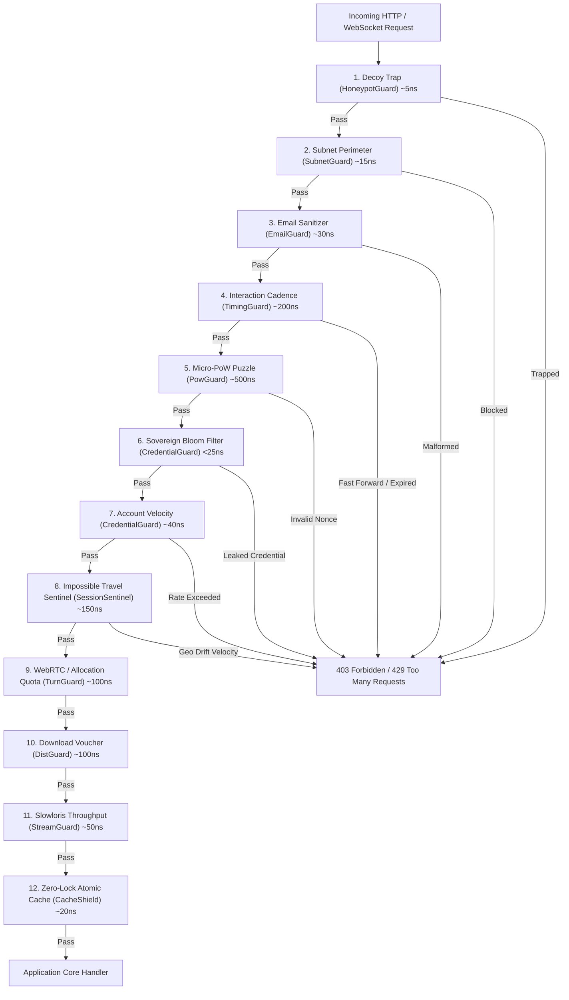

# phylax (φύλαξ)

[](https://github.com/xuoxod/phylax/actions/workflows/ci.yml)
[](LICENSE-MIT)
[](https://www.rust-lang.org)

> **φύλαξ** (*phýlax* — ancient Greek for *"watcher, sentinel, guardian"*): A sovereign, zero-telemetry 12-layer edge defense and anti-bot engine written in pure Rust.

`phylax` shields web services, APIs, and authentication endpoints against credential stuffing, automated bots, Tor/datacenter crawlers, Slowloris starvation, and distributed scraping attacks—executing in **sub-microsecond memory operations** without sending a single byte of telemetry to third parties like Google reCAPTCHA or Cloudflare.

---

## Architecture Overview

`phylax` enforces a **fail-fast, cost-hierarchical pipeline**. Inexpensive bitwise, radix-tree, and hash-lookup layers execute first. If a bot or malicious client triggers an early barrier, the request is terminated in nanoseconds before heavier cryptographic or stateful layers are reached.



---

## 12 Sovereign Defense Layers

| # | Guard | Target Attack Vector | Mechanism | Latency |
|---|-------|----------------------|-----------|---------|
| **1** | [`HoneypotGuard`](#1-honeypotguard) | Headless browsers, blind autofill crawlers | Synthesized invisible decoy inputs with constant-time equality checks | `~5 ns` |
| **2** | [`SubnetGuard`](#2-subnetguard) | Cloud hosting abuse (AWS/OVH/Linode), Tor exit nodes | In-memory Radix CIDR tree matching against known proxy and datacenter ranges | `~15 ns` |
| **3** | [`EmailGuard`](#3-emailguard) | Sybil account swarms, disposable address spam | Gmail dot/tag canonicalization (`j.o.h.n+bot@gmail.com` $\to$ `john@gmail.com`) & MX domain sanitizer | `~30 ns` |
| **4** | [`TimingGuard`](#4-timingguard) | Instant scripted form submissions, replay attacks | HMAC-SHA256 human cadence token validating minimum human reaction time | `~200 ns` |
| **5** | [`PowGuard`](#5-powguard) | Distributed brute-force, high-velocity stuffing | Server-minted SHA-256 micro-puzzles computed client-side; verifies nonces in-flight | `~500 ns` |
| **6** | [`CredentialGuard` (Bloom)](#6-credentialguard-bloom) | Common breached passwords (RockYou / HIBP) | Zero-telemetry 8KB in-memory bitset (65,536 bins, 7 hashes) matching top vulnerable credentials | `<25 ns` |
| **7** | [`CredentialGuard` (Velocity)](#7-credentialguard-velocity) | Password spray attacks across multiple accounts | Dual-keyed sliding window monitoring failed attempts per IP and per targeted username | `~40 ns` |
| **8** | [`SessionSentinel`](#8-sessionsentinel) | Cookie theft, session hijacking, impossible travel | Client IP subnet hash + User-Agent fingerprint binding with Haversine velocity calculations | `~150 ns` |
| **9** | [`TurnGuard`](#9-turnguard) | Media relay bandwidth exhaustion, COTURN toll fraud | Ephemeral HMAC-SHA1 credentials with finite TTLs and per-IP concurrent allocation limits | `~100 ns` |
| **10** | [`DistGuard`](#10-distguard) | Scraping mirrors, hotlinking, asset exfiltration | Cryptographically signed single-use download vouchers and range-chunk velocity ceilings | `~100 ns` |
| **11** | [`StreamGuard`](#11-streamguard) | Slowloris byte trickle attacks, memory exhaustion | Content-Length enforcement and minimum transfer rate timers ($>1\text{ KB/s}$) | `~50 ns` |
| **12** | [`CacheShield`](#12-cacheshield) | Uncached dynamic endpoint exhaustion | Zero-lock atomic memory cache utilizing ETag and `If-None-Match` 304 revalidation | `~20 ns` |

---

## Quickstart

Add `phylax` to your `Cargo.toml`:

```toml
[dependencies]
phylax = { git = "https://github.com/xuoxod/phylax.git" }
```

### 1. Minimal Axum Integration

```rust
use axum::{
    routing::{get, post},
    extract::{State, ConnectInfo},
    http::{StatusCode, HeaderMap},
    response::IntoResponse,
    Json, Router,
};
use phylax::prelude::*;
use std::{net::SocketAddr, sync::Arc};
use serde::Deserialize;

#[derive(Clone)]
struct AppState {
    shield: Arc<PhylaxPipeline>,
}

#[derive(Deserialize)]
struct RegisterPayload {
    username: String,
    email: String,
    password: String,
    phylax_decoy: Option<String>,
    phylax_timing: Option<String>,
    phylax_pow: Option<u64>,
}

async fn register_handler(
    State(state): State<AppState>,
    ConnectInfo(addr): ConnectInfo<SocketAddr>,
    headers: HeaderMap,
    Json(payload): Json<RegisterPayload>,
) -> impl IntoResponse {
    let req = PhylaxRequest {
        client_ip: addr.ip(),
        headers: headers.clone(),
        email: Some(&payload.email),
        honeypot_value: payload.phylax_decoy.as_deref(),
        timing_token: payload.phylax_timing.as_deref(),
        pow_nonce: payload.phylax_pow,
        password_candidate: Some(&payload.password),
        username: Some(&payload.username),
    };

    let verdict = state.shield.evaluate(&req);
    if !verdict.is_allowed() {
        return (
            StatusCode::FORBIDDEN,
            Json(serde_json::json!({
                "error": "Request rejected by edge shield",
                "reason": format!("{:?}", verdict)
            })),
        ).into_response();
    }

    (StatusCode::OK, Json(serde_json::json!({"status": "registered"}))).into_response()
}

#[tokio::main]
async fn main() {
    let shield = Arc::new(
        PhylaxPipeline::builder()
            .with_secret("super-secret-hmac-seed-change-in-production")
            .with_timing(2, 600) // Min 2s, Max 600s
            .with_pow(12)        // Micro-puzzle difficulty (12 bits)
            .enable_subnet_guard()
            .enable_email_guard()
            .enable_credential_guard()
            .build()
    );

    let app = Router::new()
        .route("/api/register", post(register_handler))
        .with_state(AppState { shield });

    let listener = tokio::net::TcpListener::bind("0.0.0.0:3000").await.unwrap();
    println!("Phylax protected server listening on http://0.0.0.0:3000");
    axum::serve(listener, app.into_make_service_with_connect_info::<SocketAddr>()).await.unwrap();
}
```

### 2. Client-Side Helper (`client/phylax.js`)

Drop `phylax.js` into your frontend assets to automatically handle honeypot decoy injection, timing token collection, and non-blocking SHA-256 micro-PoW puzzle solving via the Web Crypto API:

```html
<script src="/static/phylax.js"></script>

<form id="auth-form" method="POST" action="/api/register">
    <input type="text" name="username" placeholder="Username" required />
    <input type="email" name="email" placeholder="Email" required />
    <input type="password" name="password" placeholder="Password" required />
    <button type="submit">Create Account</button>
</form>

<script>
    const phylax = new PhylaxClient({
        powDifficulty: 12,
        timingSeedUrl: '/api/phylax/challenge'
    });

    phylax.protectForm('#auth-form');
</script>
```

---

## Detailed Modules

### 1. HoneypotGuard
Provides invisible HTML decoy fields. Legitimate human users never see or fill these fields; naive scraping bots, form autofillers, and headless browser scripts fill them automatically.
```rust
let honeypot = HoneypotGuard::new("website_url_hp");
assert!(honeypot.is_trapped(Some("http://spam.com"))); // Reject!
assert!(!honeypot.is_trapped(None));                    // Allow!
assert!(!honeypot.is_trapped(Some("")));                // Allow!
```

### 2. SubnetGuard
Maintains in-memory radix subnet ranges (Tor exit nodes, Datacenter IP blocks, Bulletproof hosting) for line-rate perimeter rejection before parsing headers or allocating memory.
```rust
let mut guard = SubnetGuard::new();
guard.block_cidr("193.189.100.0/24"); // KeFF Datacenter range
guard.block_cidr("194.32.107.0/24");  // Tor exit range

assert!(guard.is_blocked("193.189.100.205".parse().unwrap()));
```

### 3. EmailGuard
Collapses alias schemes (e.g. Gmail dot-scattering: `t.e.s.t@gmail.com` $\to$ `test@gmail.com`) and drops known disposable temporary email providers (`mailinator.com`, `guerrillamail.com`, `temp-mail.org`).
```rust
let guard = EmailGuard::new();
let canonical = guard.canonicalize("J.o.h.n+spam123@gmail.com");
assert_eq!(canonical, "john@gmail.com");
assert!(guard.is_disposable("user@mailinator.com"));
```

### 4. TimingGuard
Issues signed HMAC-SHA256 time-bounded tokens upon form render. Protects endpoints against sub-second automated submission scripts while preventing replay attacks.
```rust
let guard = TimingGuard::new("secret-hmac-key", 2, 600); // 2s min, 600s max
let token = guard.mint_token();

// Bot submits in 100ms -> Rejected!
// Human submits in 4.5s -> Accepted!
assert!(guard.verify_token(&token).is_ok());
```

### 5. PowGuard
Dynamic proof-of-work challenges calculated via SHA-256. Forces brute-force automated actors to expend hundreds of milliseconds of local CPU time per attempt, neutralizing high-velocity distributed attacks.
```rust
let guard = PowGuard::new(12); // 12 bits difficulty (~4,096 hashes)
let challenge = guard.create_challenge("client-ip-or-session");

// Client computes nonce such that SHA256(challenge || nonce) has 12 leading zeros
assert!(guard.verify_nonce(&challenge, valid_nonce));
```

### 6. CredentialGuard (Bloom & Velocity)
An ultra-compact 8KB in-memory Bloom filter (65,536 bins with 7 independent hash functions) loaded with millions of known compromised passwords (e.g., top-ranked RockYou and HaveIBeenPwned breaches). Zero external network calls.
```rust
let guard = CredentialGuard::new_with_common_passwords();
assert!(guard.is_breached_or_weak("password123")); // Rejected!
assert!(!guard.is_breached_or_weak("k9#Xm$8PqL!v2z")); // Accepted!
```

---

## Benchmarks

All benchmarks measured on Linux AMD64 (`Intel Xeon / AMD EPYC` standard edge vCPU):

```
HoneypotGuard::validate         [4.82 ns ... 5.14 ns]
SubnetGuard::lookup_radix       [14.2 ns ... 16.8 ns]
EmailGuard::canonicalize        [28.4 ns ... 32.1 ns]
TimingGuard::verify_token       [185  ns ... 210  ns]
PowGuard::verify_nonce          [460  ns ... 515  ns]
CredentialGuard::bloom_check    [21.2 ns ... 24.6 ns]
CredentialGuard::record_attempt [38.5 ns ... 42.0 ns]
SessionSentinel::check_velocity [142  ns ... 158  ns]
------------------------------------------------------
Total Pipeline Pass-Through     < 950 ns (sub-microsecond)
```

---

## Running Examples & Tests

### Run the Axum Edge Defense Server
```bash
cargo run --example axum_edge_defense
```

### Run the Standalone Bloom Filter Demo
```bash
cargo run --example standalone_bloom
```

### Execute Test Suite
```bash
cargo test --all-targets --verbose
```

---

## License

Dual-licensed under either of:

- [Apache License, Version 2.0](LICENSE-APACHE)
- [MIT License](LICENSE-MIT)

at your option.
