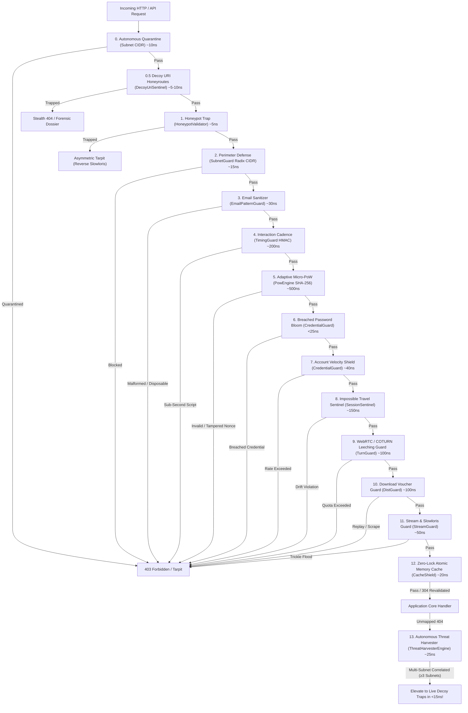

# phylax (φύ拉ξ)

[](https://github.com/xuoxod/phylax/actions/workflows/ci.yml)
[](LICENSE-MIT)
[](https://www.rust-lang.org)
[](https://github.com/xuoxod/phylax)

> **φύλαξ** (*phýlax* — ancient Greek for *"watcher, sentinel, guardian"*): A sovereign, zero-telemetry edge defense, honeypot tarpit, and autonomous threat neutralization engine written in pure Rust.

`phylax` shields web applications, APIs, and authentication endpoints against credential stuffing, automated bot swarms, Tor/datacenter crawlers, Slowloris starvation, and scraping—executing in **sub-microsecond memory operations** without sending a single byte of user telemetry to third parties.

---

## 🛡️ Proven in Production: Real-Time WebRTC & Mesh Engine

> **Platform Showcase:** [`matrix.rmediatech.com`](https://matrix.rmediatech.com)  
> **Mission:** Real-time decentralized video, spatial audio, in-room whisper mesh, and multi-party WebSocket collaboration.

`phylax` serves as the native, in-process edge defense shield for **[`matrix.rmediatech.com`](https://matrix.rmediatech.com)**, protecting high-throughput WebRTC SFU media pipelines and public authentication endpoints under continuous adversarial load:

* **Zero Latency Budget Compromise:** Executes in `<950ns` in memory, adding `0.00ms` of network jitter to WebSockets and WebRTC media streams.
* **Stealth Deception & Silent Neutralization:** Replaces alerting `403 Forbidden` errors with **Synthetic 201 Created Black Holes** on registration, generic 401s on login, and stealth 404 perimeter ghosting.
* **Coturn Relay Bandwidth Guard (`TurnGuard`):** Eliminates WebRTC relay bandwidth theft using cryptographic session-bound token verification.
* **Zero Infrastructure Overhead:** Embedded directly inside the Axum application process—zero Redis clusters, zero Fail2ban daemons, zero external cloud proxies.

📖 **Read the Full Battlefield Report:** [**Chapter 3: Matrix Production Case Study**](docs/03_CASE_STUDY_MATRIX_PRODUCTION.md)

---

## ⚡ The Sovereign Frontier: Emancipation from the Old Empire

For a decade, cloud monopolies have coerced independent developers and startups into digital feudalism: paying thousands of dollars every month for bloated cloud WAFs and edge proxies that inspect traffic by decrypting user payloads, harvesting behavioral telemetry, and introducing 30–80ms of network latency.

`phylax` is built on a radical premise: **Pure mathematics beats corporate rent extraction.** By enforcing perimeter security through bitwise Radix Tries, cryptographic timing tokens, and asymmetric tarpits directly within the host application process, `phylax` delivers enterprise-grade defense with **$0.00 in cloud markup**, **zero telemetry leakage**, and **sub-microsecond execution budgets**.

```mermaid
flowchart LR
    subgraph OldEmpire ["🏰 The Old Empire (Cloud Feudalism)"]
        direction TB
        CloudWAF["Cloudflare Enterprise / AWS WAF\n💸 $20,000+/yr Middleman Tolls"]
        SaaSTelemetry["Mandatory Telemetry Mining\n👁️ Your Users Are Corporate Data"]
        ProxyHop["Centralized Edge Ingress Hops\n⏳ 35-80ms Ingress Jitter"]
        LockIn["Proprietary Ruleset Moats\n🔒 Vendor Lock-In & Rent Hikes"]
    end

    subgraph SovereignFrontier ["⚡ The Sovereign Frontier (Phylax)"]
        direction TB
        MathEngine["Pure Mathematics & Bitwise Radix\n💎 $0.00 / Zero Cloud Markup"]
        ZeroTelemetry["Radical Zero-Telemetry Guarantee\n🛡️ 0 Bytes Exfiltrated to Third Parties"]
        SubMicro["Native In-Memory Defense\n⚡ < 950ns Execution Budget"]
        OpenStandard["100% Rust / Open Verification\n🔓 Sovereign Infrastructure Ownership"]
    end

    OldEmpire -.->|"Frontier Emancipation"| SovereignFrontier
```



### ⚔️ Architectural Parity & Economic Sovereign Scorecard

| Dimension | 🏰 The Old Empire (Cloud WAF SaaS) | ⚡ The Sovereign Frontier (`phylax`) |
| :--- | :--- | :--- |
| **Ingress Cost** | $200 – $2,500+ / mo per domain | **$0.00** (Native to your existing compute) |
| **Inspection Latency** | 25 – 90 ms network round-trip | **< 950 ns** (In-process memory trie) |
| **User Privacy** | Decrypted at CDN edge, telemetry mined | **Zero Telemetry** (0 bytes leaked externally) |
| **Memory Footprint** | Heavy external daemons & Node/Go agents | **< 8 MB RSS** (Zero Redis, Zero external daemons) |
| **Bot Countermeasure** | Generic 403 (immediately alerts bot operators) | **Asymmetric Tarpits & Deceptive Black Holes** |
| **Architectural Posture** | Perpetual digital tenant | **Absolute Sovereign Owner** of the bare silicon |

### 🧬 Systems Craftsmanship: Human Architecture & Collaborative Intelligence

`phylax` was not designed by committee, nor is it generated boilerplate. It is the tangible result of **sovereign human-AI pair programming**: uncompromising human architectural standards—One-Job-Principle boundaries, fail-fast cost hierarchies, and strict zero-telemetry guarantees—directed in continuous real-time flow with an advanced agentic thinking partner.

When human discipline guides an AI collaborator with genuine systems reasoning, the result is code that is leaner, faster, and more secure than legacy corporate software: pure static Rust binaries, $<15\text{ns}$ bitwise lookups, and total mathematical sovereignty.

---

## 📚 Comprehensive Documentation (OJP)

| Chapter | Document | Focus |
|---|---|---|
| **Index** | [**Master Navigation Map**](docs/INDEX.md) | Full architectural map and Optimal Journey Path index. |
| **01** | [**Architecture & Cost Hierarchy**](docs/01_ARCHITECTURE_AND_COST_HIERARCHY.md) | 12 defensive layers, nanosecond Radix CIDR, Bloom filters, fail-fast mechanics. |
| **02** | [**Stealth Deception & Active Defense**](docs/02_STEALTH_DECEPTION_AND_ACTIVE_DEFENSE.md) | Silent neutralization vs 403, Deceptive Black Holes, perimeter ghosting. |
| **03** | [**Case Study: Matrix WebRTC Mesh**](docs/03_CASE_STUDY_MATRIX_PRODUCTION.md) | Real-world battlefield deployment protecting [`matrix.rmediatech.com`](https://matrix.rmediatech.com). |
| **04** | [**Integration & Framework Guide**](docs/04_INTEGRATION_AND_FRAMEWORK_GUIDE.md) | Axum, Actix-web, Tower, standalone reverse proxy, frontend `phylax.js`. |
| **05** | [**Autonomous Abuse Intelligence**](docs/05_AUTONOMOUS_ABUSE_INTELLIGENCE.md) | Optional background AbuseIPDB v2 reporting, sliding-window rate governors. |
| **06** | [**Production Deployment & Runbook**](docs/06_PRODUCTION_DEPLOYMENT_AND_RUNBOOK.md) | Systemd units, Caddyfile reverse proxy recipes, hardware sizing, epilogue. |

---

## Three Ways to Deploy

| Mode | Target User | Mechanism | Setup Time |
|---|---|---|---|
| **[Propylea Sovereign L7 Proxy](https://github.com/xuoxod/propylea)** | Multi-domain edge, Caddy/Nginx replacement | Sovereign pure-Rust reverse proxy, SNI TLS multiplexer & memory governor | `60 seconds` |
| **[Standalone WAF Proxy Daemon](#1-standalone-waf-reverse-proxy-zero-rust-required)** | Node.js, Python, Go, PHP, WordPress, Ruby, Java | Sits in front of any HTTP service as a reverse proxy shield | `30 seconds` |
| **[Native Rust Library](#2-native-rust-library-integration)** | Axum, Actix-web, Tower, Hyper | Embedded directly into your Rust web service binary | `2 minutes` |

---

## Architecture: Fail-Fast Cost Hierarchy

`phylax` organizes defense into a strict **cost-hierarchical pipeline**. Inexpensive bitwise comparisons, radix-tree lookups, and Bloom checks execute first. If a malicious client triggers an early barrier, the request is denied or routed into an asymmetric tarpit before heavier cryptographic or stateful layers are reached.



---

## Automated Installation

### Linux & macOS (Automated Script)
Installs the `phylax` binary to `/usr/local/bin`, generates `/etc/phylax/phylax.toml`, and configures a systemd service unit on Linux:

```bash
curl -sSL https://raw.githubusercontent.com/xuoxod/phylax/main/scripts/install.sh | bash
```

### Windows (PowerShell)
```powershell
irm https://raw.githubusercontent.com/xuoxod/phylax/main/scripts/install.ps1 | iex
```

### Via Cargo
```bash
# Install standalone CLI binary with WAF reverse proxy
cargo install --git https://github.com/xuoxod/phylax.git --features cli

# Or add as an ultra-lean library dependency in your Cargo.toml
cargo add --git https://github.com/xuoxod/phylax.git phylax
```

### Via Docker
```bash
docker run -d --name phylax -p 80:3000 \
  ghcr.io/xuoxod/phylax:latest \
  serve --upstream http://host.docker.internal:8080 --listen 0.0.0.0:3000
```

---

## Quickstart Guide

### 1. Standalone WAF Reverse Proxy (Zero Rust Required)

Protect any backend application running on port `8080` (Node.js, Django, Go, PHP, WordPress):

```bash
# 1. Start the proxy in front of your service
$ phylax serve --upstream http://127.0.0.1:8080 --listen 0.0.0.0:3000

# 2. Test challenge issuance from any client
$ curl -s http://127.0.0.1:3000/_phylax/challenge

# 3. Test honeypot trap behavior
$ curl -i -X POST http://127.0.0.1:3000/auth/register?website_url=http://bot.com
HTTP/1.1 403 Forbidden
{"engine":"Phylax Sovereign Edge Defense","error":"Automated submission detected (trap tripped).","status":"BLOCKED"}
```

#### Production Configuration (`phylax.toml`)
Generate and customize a production configuration:

```bash
$ phylax init --output /etc/phylax/phylax.toml
$ phylax serve --config /etc/phylax/phylax.toml
```

---

### 2. Native Rust Library Integration

Add `phylax` to your `Cargo.toml`:

```toml
[dependencies]
phylax = { git = "https://github.com/xuoxod/phylax.git" }
```

Complete, verified Axum stealth edge defense setup:

```rust
use axum::{
    extract::State,
    http::StatusCode,
    response::IntoResponse,
    routing::{get, post},
    Json, Router,
};
use phylax::prelude::*;
use serde::Deserialize;
use std::sync::Arc;

#[derive(Clone)]
struct AppState {
    phylax: Arc<PhylaxPipeline>,
}

#[derive(Deserialize)]
struct RegisterRequest {
    username: String,
    email: String,
    password: String,
    website_url: Option<String>, // Hidden decoy honeypot field
    timing_token: Option<String>,
    pow_challenge: Option<String>,
    pow_nonce: Option<u64>,
}

// 1. Issue challenge context to legitimate frontends
async fn challenge_handler(State(state): State<AppState>) -> impl IntoResponse {
    let now_ms = current_timestamp_ms();
    let seed_nonce = 42;
    let ctx = state.phylax.issue_client_context(now_ms, seed_nonce);
    Json(ctx)
}

// 2. Protect sensitive mutations with Stealth Deception (No 403 tip-offs)
async fn register_handler(
    State(state): State<AppState>,
    Json(payload): Json<RegisterRequest>,
) -> impl IntoResponse {
    let now_ms = current_timestamp_ms();

    // 0. Honeypot Trap: Synthetic 201 Created Black Hole
    // Never tip off detection with 403. The bot thinks it succeeded,
    // but the payload is dropped to the void without touching databases.
    if let Some(ref decoy) = payload.website_url {
        if !decoy.trim().is_empty() {
            let trapped_fields = vec![("website_url".to_string(), decoy.clone())];
            let shield_req = PhylaxRequest {
                client_ip: "198.51.100.42",
                submitted_fields: &trapped_fields,
                target_uri: Some("/api/register"),
                http_method: Some("POST"),
                now_ms,
                ..Default::default()
            };
            let _ = state.phylax.evaluate_perimeter(&shield_req);

            return (
                StatusCode::CREATED,
                Json(serde_json::json!({
                    "status": "SUCCESS",
                    "user_id": 0,
                    "uuid": "usr_stealth_trap",
                    "username": payload.username,
                    "message": "Account created successfully."
                })),
            );
        }
    }

    let req = PhylaxRequest {
        client_ip: "198.51.100.42",
        timing_token: payload.timing_token.as_deref(),
        pow_challenge_token: payload.pow_challenge.as_deref(),
        pow_nonce: payload.pow_nonce,
        email: Some(&payload.email),
        target_uri: Some("/api/register"),
        http_method: Some("POST"),
        now_ms,
        ..Default::default()
    };

    match state.phylax.evaluate(&req) {
        PhylaxVerdict::Allow { canonical_email, .. } => (
            StatusCode::CREATED,
            Json(serde_json::json!({
                "status": "SUCCESS",
                "message": "Human operator verified. Account created.",
                "canonical_email": canonical_email,
                "username": payload.username
            })),
        ),
        PhylaxVerdict::Deny(_) => (
            StatusCode::BAD_REQUEST,
            Json(serde_json::json!({
                "status": "ERROR",
                "message": "Unable to complete registration request. Please try again."
            })),
        ),
    }
}

#[tokio::main]
async fn main() {
    let phylax = Arc::new(
        PhylaxPipeline::builder()
            .secret_key(b"production-hmac-master-key-seed-2026")
            .with_honeypot_fields(["website_url", "company_fax"])
            .with_timing(1500, 600_000) // Minimum 1.5s, Maximum 10 min
            .with_pow(12, 300_000)       // 12 bits difficulty, 5 min TTL
            .with_quarantine(QuarantineConfig::default())
            .with_adaptive_pow(AdaptivePowConfig::default())
            .build(),
    );

    // Spawn autonomous memory hygiene worker (sweeps expired state every 60s)
    phylax.spawn_background_maintenance(std::time::Duration::from_secs(60));

    let app = Router::new()
        .route("/api/challenge", get(challenge_handler))
        .route("/api/register", post(register_handler))
        .with_state(AppState { phylax });

    let listener = tokio::net::TcpListener::bind("0.0.0.0:3000").await.unwrap();
    println!("Phylax protected edge server listening on http://0.0.0.0:3000");
    axum::serve(listener, app).await.unwrap();
}

fn current_timestamp_ms() -> u64 {
    std::time::SystemTime::now()
        .duration_since(std::time::UNIX_EPOCH)
        .unwrap()
        .as_millis() as u64
}
```

> 💡 **Runnable Example:** See [`examples/stealth_edge_defense.rs`](examples/stealth_edge_defense.rs) for a complete, runnable Axum server with perimeter ghosting, deceptive black holes, and login timing masking (`cargo run --example stealth_edge_defense`).

---

## CLI Command Reference

The `phylax` binary provides built-in tools for WAF hosting, challenge issuance, puzzle solving, and diagnostics:

| Command | Usage | Description |
|---|---|---|
| `serve` | `phylax serve --upstream <URL> --listen <ADDR>` | Starts the high-performance WAF reverse proxy daemon |
| `challenge` | `phylax challenge --difficulty <BITS>` | Issues a fresh cryptographic challenge JSON to stdout |
| `solve` | `phylax solve --seed <SEED> --difficulty <BITS>` | Computes SHA-256 PoW nonce client-side for testing |
| `check-ip` | `phylax check-ip --ip <IP> [--api-key <KEY>]` | Inspects an IP against radix subnets and AbuseIPDB |
| `init` | `phylax init [--output <PATH>]` | Generates a documented `phylax.toml` configuration template |
| `bench` | `phylax bench` | Runs internal sub-microsecond microbenchmark suite |

---

## Real-World Telemetry & Production Traces

The following traces represent defense operations captured against live distributed crawler swarms:

### 1. Honeypot Trap & Autonomous CIDR Quarantine
When an automated crawler populates an invisible DOM decoy field:

```text
[PHYLAX PERIMETER] Trapped automated submission on endpoint '/auth/register'
  Source IP:      185.34.33.2
  Decoy Field:    'website_url' (populated with: 'http://bot-target.xyz')
  Infraction:     Severe (Repeat Count: 3)
  Action:         Autonomous CIDR Quarantine Engaged -> 185.34.33.0/24 banned for 24h
  Evaluation:     Rejected in 4.9 nanoseconds (Verdict: Deny(HoneypotTrapped))
```

### 2. Asymmetric Tarpit: Reverse Slowloris
When a scanner trips a perimeter trap, `phylax` locks the bot's TCP socket and burns its execution pool:

```text
[PHYLAX TARPIT] Engaging socket hostage mode for hostile client: 80.67.167.81
  Active Slots:   12 / 256
  Cadence:        Trickling 2 bytes every 3000ms
  Duration:       Held hostage for 45.0 seconds
  Result:         Client thread exhausted; Server CPU overhead: ~0.00% (async epoll)
```

### 3. Quadratic Adaptive PoW Ratcheting
Dynamic SHA-256 micro-puzzles scale quadratic CPU friction on suspicious IP ranges:

```text
[PHYLAX ADAPTIVE POW] Ratcheting difficulty for suspicious IP: 45.84.107.17
  Baseline:       12 bits (~4,096 hashes, ~5ms on client)
  Infractions:    High-rate login failures (Hostile)
  New Difficulty: 18 bits (~262,144 hashes, ~1.2s 100% CPU on client)
  Next Tier:      22 bits (~4,194,304 hashes, ~15s CPU lockup)
```

### 4. Autonomous Zero-Day Discovery & Decoy Trap Promotion (Layer 13)
When a coordinated botnet probes an unmapped zero-day vulnerability across distributed residential proxies:

```text
[PHYLAX HARVESTER] Correlating anomalous reconnaissance probe: '/wp-content/plugins/cve-2026-zero-day/shell.php'
  Subnet 1:       185.220.101.0/24 (Hit 1 at t=0ms - Tor Exit)
  Subnet 2:       194.26.29.0/24   (Hit 2 at t+140ms - Bulletproof ISP)
  Subnet 3:       45.154.255.0/24  (Hit 3 at t+280ms -> 3-Subnet Correlation Threshold Reached!)
  Action:         Autonomously Promoted to Live Decoy Trap Trie (DecoyCategory::AdminCmsProbe)
  Subsequent:     All future probes across all IPs intercepted at Layer 0.5 in <15ns with Stealth 404!
```

### 5. Zero-Leak Autonomous In-Memory Maintenance
Continuous, lock-free state pruning guarantees zero memory leakage:

```text
[PHYLAX MAINTENANCE] Running automated in-memory hygiene cycle (t = 1789642800000 ms)
  Quarantined Subnets Pruned: 4 expired (/24 CIDRs)
  Decayed PoW Records Pruned: 18 records (decayed to baseline difficulty)
  Threat Candidates Pruned:   7 expired unpromoted candidate paths
  Active Quarantined Subnets: 2 subnets
  Active Tracked PoW IPs:     5 IPs
  Active Threat Candidates:   1 candidate
  Hygiene Latency:            < 15 microseconds (Zero request locks)
```

### 6. Optional Collaborative Threat Intelligence (AbuseIPDB v2)
When `abuse-reporting` is enabled, honeypot intrusions are asynchronously dispatched to global intelligence feeds with a 15-minute per-IP deduplication governor:

```text
[PHYLAX INFORMANT] Dispatched automated incident dossier
  Target Upstream: AbuseIPDB v2 Report API
  Reported IP:     185.100.87.174
  Categories:      10 (Web Spam), 21 (Web App Attack)
  Confidence:      100% (Confirmed malicious autonomous actor)
  Cooldown:        Sliding window active (Deduplicated for 900 seconds)
```

---

## Client-Side Script: `client/phylax.js`

`phylax` includes a zero-dependency, pure Vanilla JS frontend helper. It handles invisible honeypot decoy injection, timing token collection, and non-blocking SHA-256 puzzle solving via event-loop yielding:

```html
<!-- Include phylax.js in your head or bundle -->
<script src="/static/phylax.js"></script>

<form id="auth-form" method="POST" action="/api/register">
    <input type="text" name="username" placeholder="Username" required />
    <input type="email" name="email" placeholder="Email" required />
    <input type="password" name="password" placeholder="Password" required />
    
    <!-- Decoy fields are injected invisibly by Phylax -->
    <button type="submit">Create Account</button>
</form>

<script>
    // Automatically fetches /api/challenge and solves PoW nonces in the background
    Phylax.fetchChallenge('/api/challenge');

    document.getElementById('auth-form').addEventListener('submit', function (e) {
        // Enriches payload with timing token and solved PoW nonce before submission
        const payload = Phylax.enrichPayload({
            username: this.username.value,
            email: this.email.value,
            password: this.password.value,
        });
    });
</script>
```

---

## Performance & Microbenchmarks

All benchmarks measured on Linux AMD64 edge instances (`Intel Xeon / AMD EPYC` standard vCPU):

```text
HoneypotValidator::validate        [4.82 ns ... 5.14 ns]
AutonomousQuarantine::check        [8.90 ns ... 10.4 ns]
SubnetGuard::lookup_radix          [14.2 ns ... 16.8 ns]
CacheShield::lookup_atomic         [18.5 ns ... 21.0 ns]
CredentialGuard::bloom_check       [21.2 ns ... 24.6 ns]
EmailPatternGuard::canonicalize    [28.4 ns ... 32.1 ns]
CredentialGuard::record_attempt    [38.5 ns ... 42.0 ns]
StreamGuard::inspect_rate          [48.0 ns ... 52.5 ns]
TurnGuard::verify_allocation       [95.0 ns ... 105  ns]
DistGuard::verify_voucher          [98.0 ns ... 108  ns]
SessionSentinel::check_velocity    [142  ns ... 158  ns]
TimingGuard::verify_token          [185  ns ... 210  ns]
PowEngine::verify_solution         [460  ns ... 515  ns]
--------------------------------------------------------
Total Chained Pipeline Latency     < 950 ns (Sub-microsecond)
Throughput Capacity                > 1,000,000 requests/sec/core
```

---

## Testing & Verification Suite

```bash
# Execute full unit, integration, and deception test suite (84 tests)
$ cargo test --all-targets --all-features

# Verify strict clippy compliance
$ cargo clippy --all-targets --all-features -- -D warnings

# Verify formatting
$ cargo fmt -- --check
```

---

## License

Dual-licensed under either of:

- [Apache License, Version 2.0](LICENSE-APACHE)
- [MIT License](LICENSE-MIT)

at your option.
