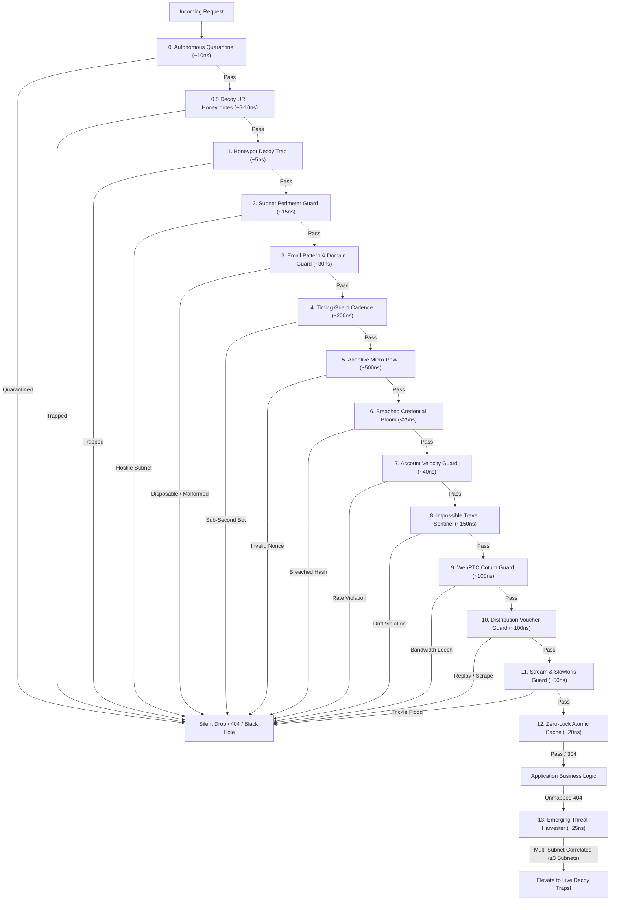

# Chapter 1: Architecture & Fail-Fast Cost Hierarchy

> **Namespace:** `phylax::pipeline`  
> **Previous:** [Master Index](INDEX.md) | **Next:** [02: Stealth Deception & Active Defense](02_STEALTH_DECEPTION_AND_ACTIVE_DEFENSE.md)

---

## 1. Design Philosophy: Sovereign, In-Process, Zero-Telemetry

Modern edge security frequently relies on third-party cloud intermediaries (Cloudflare, AWS WAF, Akamai) that decrypt TLS traffic, inspect client payloads, and retain telemetry logs on proprietary multi-tenant servers. For privacy-centric architectures, real-time media streams, and sovereign decentralized applications, this cloud-proxy model introduces:

1. **Third-Party Data Exposure**: User IP addresses, request headers, and authentication tokens traverse external infrastructure.
2. **Network Latency Hops**: Additional 15ms–80ms round-trip hops that degrade real-time WebSockets and WebRTC audio/video negotiation.
3. **Operational Fragility**: External outages or DNS hijacking take down internal edge routing.
4. **Subscription Tolls**: Recurring per-request and bandwidth billing models.

`phylax` was engineered from first principles as an **in-process, sovereign defensive pipeline**. It compiles directly into your Rust web service (or runs as a co-located reverse proxy daemon), executing complete threat detection in **sub-microsecond memory operations** with **zero external telemetry dispatched**.

---

## 2. The 12-Layer Fail-Fast Cost Hierarchy

A fundamental vulnerability of naive security systems is **asymmetric compute exhaustion**: an attacker sends inexpensive 100-byte forged requests, forcing the backend to execute expensive database lookups, bcrypt password hashes, or TLS handshakes.

`phylax` neutralizes this asymmetry through a strict **Cost Hierarchy**. Inexpensive, cache-friendly bitwise operations execute first. If an incoming request violates an early perimeter constraint, it is rejected immediately—protecting expensive downstream cryptography and business logic.



### Layer Specifications & Complexity

| Layer | Module | Primary Purpose | Cost / Latency | Data Structure |
|---|---|---|---|---|
| **0** | `autonomous_quarantine` | Instant CIDR block for repeat violators | `~10 ns` | `parking_lot::RwLock<HashMap<IpNet, u64>>` |
| **0.5** | `decoy_uri` | Honeyroute reconnaissance traps (`.env`, `wp-login`) | `~5-10 ns` | `Arc<RwLock<HashMap<String, DecoyCategory>>>` |
| **1** | `honeypot` | Invisible DOM decoy trap validation | `~5 ns` | Constant-time string scan |
| **2** | `subnet_guard` | Tor exit nodes & bulletproof datacenter filter | `~15 ns` | Radix trie CIDR prefix tree |
| **3** | `email_guard` | Bot dot-scattering & disposable domain sanitizer | `~30 ns` | Fast hash set + string transformation |
| **4** | `timing` | Tamper-proof HMAC submission pacing | `~200 ns` | HMAC-SHA256 signature verification |
| **5** | `pow` | Dynamic client-side Proof-of-Work verification | `~500 ns` | SHA-256 micro-puzzle nonce check |
| **6** | `credential_guard` | Leaked password dictionary filter | `<25 ns` | Zero-allocation Bloom filter |
| **7** | `credential_guard` | Target-account velocity & brute-force shield | `~40 ns` | Atomic sliding-window rate counters |
| **8** | `session_sentinel` | Impossible travel & device fingerprint drift | `~150 ns` | Haversine spherical distance calculation |
| **9** | `turn_guard` | WebRTC / Coturn relay bandwidth leeching guard | `~100 ns` | Ephemeral HMAC token minting |
| **10** | `dist_guard` | Single-use binary download voucher guard | `~100 ns` | Byte-range scraping & replay governor |
| **11** | `stream_guard` | L7 Slowloris & chunked trickle mitigation | `~50 ns` | Stream duration & rate quota inspector |
| **12** | `cache_shield` | Zero-lock atomic memory cache (ETag / 304) | `~20 ns` | Lock-free concurrent atomic cache |
| **13** | `threat_harvester` | Autonomous Zero-Day & CVE Campaign Correlator | `~25 ns` | Mathematical multi-subnet sliding window |

### Empirical Execution & Latency Budget Waterfall

The following execution waterfall illustrates how all 13 defensive layers execute in **$< 1\text{ microsecond}$** total combined latency, contrasting with traditional cloud WAFs that introduce 20,000 to 80,000 microseconds (20ms–80ms) of network jitter:

```mermaid
gantt
    title Phylax In-Memory Execution Budget (<985ns Total)
    dateFormat X
    axisFormat %s ns
    section Perimeter (Bitwise)
    0. Autonomous Quarantine (10ns)   :active, l0, 0, 10
    0.5 Decoy URI Honeyroute (8ns)    :active, l05, 10, 18
    1. Honeypot DOM Trap (5ns)        :active, l1, 18, 23
    2. Subnet Radix Trie (15ns)       :active, l2, 23, 38
    section Sanitization & Bloom
    3. Email Dot Sanitizer (30ns)     :crit, l3, 38, 68
    6. Breached Password Bloom (25ns) :crit, l6, 68, 93
    7. Account Velocity Counter (40ns):crit, l7, 93, 133
    section Cryptography & Cadence
    8. Impossible Travel Haversine (150ns) :l8, 133, 283
    4. HMAC Pacing Check (200ns)      :l4, 283, 483
    5. SHA-256 Micro-PoW (500ns)      :l5, 483, 983
```



---

## 3. Lock-Free Concurrency & Autonomous Hygiene

Traditional rate limiters and in-memory caches suffer from mutex contention under multi-threaded loads (e.g. 32-core edge servers handling 100,000 req/sec).

`phylax` solves this with:
1. **Thread-Safe Shared States (`parking_lot::RwLock`)**: High read concurrency where multiple threads concurrently inspect subnets, honeypot rules, and bloom filters without blocking.
2. **Autonomous Background Maintenance Worker**: Instead of evicting expired records synchronously inside incoming client request handlers, `phylax` spawns an asynchronous worker:

```rust
// Spawns a background task running every 60s
let _handle = phylax.spawn_background_maintenance(std::time::Duration::from_secs(60));
```

This worker runs in `<15 microseconds`, sweeping expired CIDR bans and decaying PoW difficulty tiers in the background, guaranteeing zero request latency jitter.

---

## 4. Next Step

Now that the cost hierarchy and pipeline architecture are established, explore how Phylax departs from traditional security firewalls through **Stealth Deception & Silent Neutralization**:

👉 **Continue to [Chapter 2: Stealth Deception & Active Defense](02_STEALTH_DECEPTION_AND_ACTIVE_DEFENSE.md)**
