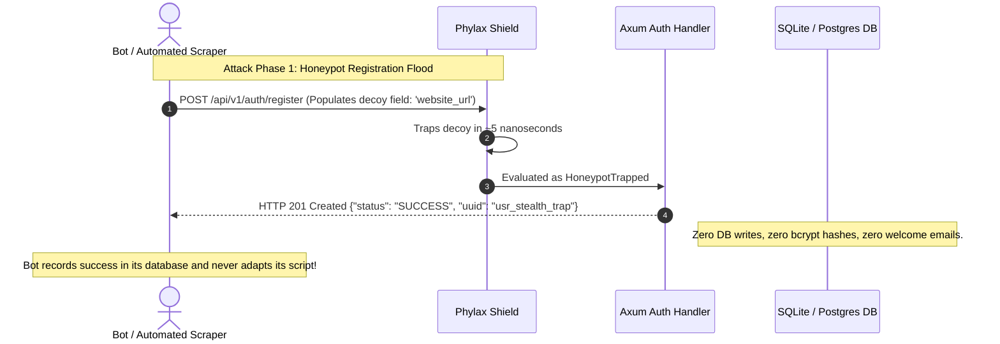

# Chapter 2: Stealth Deception & Active Defense

> **Namespace:** `phylax::honeypot`, `phylax::tarpit`  
> **Previous:** [01: Architecture & Cost Hierarchy](01_ARCHITECTURE_AND_COST_HIERARCHY.md) | **Next:** [03: Case Study: Matrix WebRTC Mesh](03_CASE_STUDY_MATRIX_PRODUCTION.md)

---

## 1. The Fatal Flaw of Conventional Firewalls: The `403 Forbidden` Signal

Traditional Web Application Firewalls and rate limiters operate on an explicit denial model:

```http
HTTP/1.1 403 Forbidden
Content-Type: application/json
X-RateLimit-Remaining: 0
CF-Ray: 8a4b2c89-iad

{"error": "Access Denied: Automated bot activity detected by WAF"}
```

While this appears definitive, in modern adversarial engineering, **an explicit `403 Forbidden` or `429 Too Many Requests` is an active reconnaissance leak**. It provides the attacker with immediate intelligence:

1. **Detection Confirmation**: The bot operator immediately knows their script was identified.
2. **Rule Fingerprinting**: The response headers and status codes indicate which vendor or rule was tripped.
3. **Automated Mutation**: The bot engine automatically triggers proxy rotation, header randomization, or fallback evasion routines.

---

## 2. The Phylax Active Defense Paradigm: Silent Neutralization

`phylax` inverts this dynamic through **Stealth Deception**. Rather than alerting the attacker that their intrusion was identified, `phylax` neutralizes hostile activity by returning deceptive responses indistinguishable from regular system behavior.



---

## 3. The Three Pillars of Stealth Deception

### Pillar 1: The Deceptive Black Hole (`POST /register`)
Automated credential harvesting and spam account creators test registration endpoints by asserting `response.status_code == 200` or `201`.

When a bot populates an invisible honeypot decoy field (`website_url`, `company_fax`):
1. `phylax` detects the non-empty decoy field in `<5 nanoseconds`.
2. The server records the client IP in `AutonomousQuarantine` and ratchets `AdaptivePow` difficulty.
3. The server immediately returns a synthetic `201 Created` payload:
   ```json
   {
     "status": "SUCCESS",
     "user_id": 0,
     "uuid": "usr_stealth_trap",
     "message": "Account created successfully."
   }
   ```
4. **The payload is silently dropped to the void.** No database row is created. No password hash is generated. No welcome email is sent.
5. **Outcome:** The bot script logs a "successful" registration, burns the attacker's compute, and never modifies its evasion tactics.

### Pillar 2: Indistinguishable Auth Masking (`POST /login`)
When an attacker attempts credential stuffing with a bot that populates decoy fields:
1. Returning `403 Forbidden` tells the attacker that their credentials might be correct, but their request transport was flagged.
2. Instead, `phylax` instructs the login handler to inject an intentional **150ms timing delay** (mirroring standard password verification latency) and return:
   ```json
   {
     "status": "ERROR",
     "message": "Incorrect username or password. Please try again."
   }
   ```
3. **Outcome:** The attacker cannot distinguish between an incorrect password and a security trap. Their dictionary scanner records the password as invalid and moves on.

### Pillar 3: Perimeter Ghosting (`404 Not Found`)
When requests originate from confirmed hostile subnets (quarantined CIDRs, datacenter scrapers, or Tor exit nodes):
- Instead of returning `403 Forbidden` or a branded firewall splash screen, `phylax` perimeter middleware returns:
  ```text
  404 Not Found
  ```
- **Outcome:** Automated port and path scanners assume the endpoint does not exist or has been decommissioned, dropping it from their target index.

### Pillar 4: Decoy URI Honeyroutes (`phylax::decoy_uri`)
Automated vulnerability scanners (Nuclei, Nikto, Shodan, Censys) constantly crawl for configuration and credential leaks:
- Probing targets: `/.env`, `/.git/HEAD`, `/app/terraform.tfstate`, `/.azure/credentials`, `/wp-login.php`, `/private.key`.
- **Zero Human False Positives:** Legitimate end users never manually navigate to `/.azure/credentials` or `/pip.conf`.
- **Stealth Action:** `phylax` intercepts the probe in `<10ns`, normalizes multi-slashes (`//.env`), returns a stealth `404 Not Found` to prevent rule fingerprinting, ratchets client IP adaptive PoW penalties, and autonomously dispatches forensic incident dossiers to AbuseIPDB (Category 15: *Hacking*, Category 21: *Web App Attack*) and registered SIEM webhooks.

---

## 4. The Asymmetric Tarpit: Reverse Slowloris

For relentless scanners that ignore HTTP status codes and spam endpoints indiscriminately, `phylax` features an asynchronous **Tarpit Governor** (`phylax::tarpit::TarpitGovernor`):

```rust
let governor = TarpitGovernor::new(TarpitConfig {
    max_concurrent_slots: 256,
    trickle_interval_ms: 3000,
    max_duration_secs: 45,
    bytes_per_chunk: 2,
});
```

### Mechanics:
1. When engaged, `phylax` accepts the client's TCP socket and returns an HTTP `200 OK` header.
2. It then streams chunks of **2 bytes every 3,000 milliseconds** over a 45-second duration.
3. **Asymmetric Resource Burn:**
   - **Attacker Impact:** The client thread (Python requests, cURL, headless Chromium) remains locked in an `await` state, consuming worker threads, memory, and socket pools.
   - **Server Overhead:** Handled via Tokio async epoll with **~0.00% CPU overhead** and zero OS threads blocked.

---

## 5. Next Step

See this exact stealth architecture in action within a mission-critical, real-time WebRTC communications platform:

👉 **Continue to [Chapter 3: Proven in Production: Matrix Case Study](03_CASE_STUDY_MATRIX_PRODUCTION.md)**
