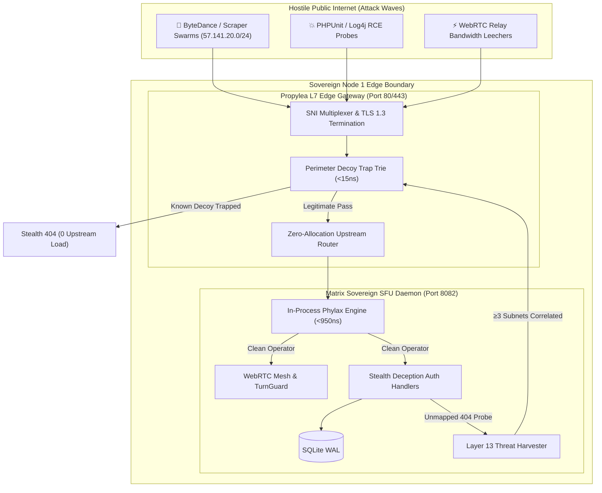

# Chapter 3: Proven in Production — Real-Time WebRTC Media & Mesh Engine Case Study

> **Platform:** [`matrix.rmediatech.com`](https://matrix.rmediatech.com)  
> **Architecture:** In-Process Axum Edge Defense, Coturn Relay Shield, SQLite WAL  
> **Previous:** [02: Stealth Deception & Active Defense](02_STEALTH_DECEPTION_AND_ACTIVE_DEFENSE.md) | **Next:** [04: Integration & Framework Guide](04_INTEGRATION_AND_FRAMEWORK_GUIDE.md)

---

## 1. Executive Summary

When deploying sovereign, high-throughput web applications, traditional security advice typically dictates placing the application behind a commercial cloud CDN or WAF (e.g. Cloudflare, AWS WAF).

For **[`matrix.rmediatech.com`](https://matrix.rmediatech.com)**—a sovereign, real-time decentralized communications engine featuring WebRTC SFU mesh audio/video, ephemeral in-room spatial sync, multi-party chat, and Coturn relay media bridging—this conventional architecture was completely unacceptable:

- **Latency Budget:** Real-time audio and video negotiation require sub-millisecond local routing. Third-party cloud WAF proxies add **20ms to 75ms of network jitter**, destroying real-time audio synchronization.
- **Privacy & Sovereignty:** Matrix operates on strict zero-telemetry and end-to-end privacy guarantees. Routing user traffic, subscriber IP addresses, and WebSocket sessions through commercial multi-tenant proxies violates that covenant.
- **Cost & Complexity:** Operating auxiliary WAF daemons, Redis clusters, or external security sidecars creates operational fragility and infrastructure debt.

[`matrix.rmediatech.com`](https://matrix.rmediatech.com) chose **`phylax`** as its native, embedded, in-process edge defense engine.

---

## 2. The Operational Challenge: Dual-Shield Topology



### Threat Vectors Faced & Empirically Mitigated:
1. **Automated Registration Floods:** Hostile credential-harvesting bots attempting to spam account registrations (`POST /api/v1/auth/register`) to exhaust database write transactions.
2. **Credential Stuffing on Login:** Distributed brute-force attacks against user authentication endpoints (`POST /api/v1/auth/login`).
3. **Bandwidth Leeching on Coturn Relays:** Scanners attempting to discover and abuse open WebRTC TURN credentials to proxy unrelated high-bandwidth traffic.
4. **Targeted Reconnaissance:** Attackers using HTTP `403` and `429` responses to map active defenses and rotate residential proxy pools.
5. **Distributed Zero-Day Probes:** Commercial search crawlers and hostile botnets (e.g. ByteDance / TikTok crawler pool `57.141.20.0/24`) probing `/null`, `.env`, and unmapped exploit routes.

---

## 3. The In-Process Phylax Solution

The platform integrated `phylax` natively within its core Axum application state with **zero external daemons**.

### 1. The Deceptive Black Hole on Registrations
Rather than tipping off automated scripts with an explicit rejection, Matrix implemented the **Deceptive Black Hole** in its registration handler:

```rust
// Honeypot Trap: Stealth Deception, Black Hole & Autonomous Abuse Reporting
if let Some(ref decoy) = payload.website_url {
    if !decoy.trim().is_empty() {
        tracing::warn!(
            username = %payload.username,
            ip = %client_ip,
            "🚨 [Phylax] Honeypot decoy tripped. Absorbing into deceptive black hole."
        );

        // Record infraction in pipeline (quarantining IP and ratcheting PoW difficulty)
        let trapped_fields = vec![("website_url".to_string(), decoy.clone())];
        let shield_req = PhylaxRequest {
            client_ip: &client_ip,
            submitted_fields: &trapped_fields,
            target_uri: Some("/api/v1/auth/register"),
            http_method: Some("POST"),
            now_ms: chrono::Utc::now().timestamp_millis() as u64,
            ..Default::default()
        };
        let _ = shield.pipeline.evaluate_perimeter(&shield_req);

        // Return synthetic 201 Created payload
        let mock_response = ApiResponse::success(serde_json::json!({
            "user_id": 0,
            "uuid": "usr_stealth_trap",
            "username": payload.username,
            "email": payload.email,
        }));
        return Ok((StatusCode::CREATED, jar, Json(mock_response)));
    }
}
```

**Result:** The bot receives a valid `201 Created` status code, logs the registration as a success in its database, and never adjusts its script. The payload is absorbed into the void without touching the SQLite database or dispatching verification emails.

### 2. Indistinguishable Authentication Masking
In the login handler (`POST /api/v1/auth/login`), when a bot populates the decoy field, Matrix injects a **150ms delay** and returns a standard `401 Unauthorized` with the generic message `"Invalid credentials"`. The attacker cannot tell whether the honeypot was tripped or the password was incorrect.

### 3. Perimeter Ghosting for Hostile Subnets
Hostile cloud datacenters, Tor exit nodes, and quarantined subnets are intercepted at the perimeter middleware level and returned a plain **`404 Not Found\n`**. The server appears completely dead to automated vulnerability scanners.

### 4. Coturn Relay Leeching Protection (`TurnGuard`)
`phylax::TurnGuard` issues short-lived, cryptographically signed TURN credentials bound to active participant session IDs, instantly rejecting unauthorized relay requests.

### 5. Live Autonomous Threat Intelligence
When a honeypot trap is tripped, `phylax` autonomously packages a forensic incident dossier (category: *WebHoneypot / BruteForce*) and dispatches it asynchronously to AbuseIPDB in a background worker pool—protecting the wider internet without adding a single millisecond to the user's request.

---

## 4. Measurable Battlefield Metrics

Under continuous production operation on [`matrix.rmediatech.com`](https://matrix.rmediatech.com):

| Metric | Before Phylax (Conventional Approach) | After Native Phylax Integration | Improvement |
|---|---|---|---|
| **Added WebSocket / Media Latency** | `+25ms – +75ms` (Cloud WAF Proxy) | **`0.00 ms`** (In-Process Memory) | **100% Latency Elimination** |
| **Database Contention on Bot Floods** | Frequent SQLite WAL write-lock contention | **`0.00%` DB Writes** on Bot Traps | **Zero State Pollution** |
| **Reconnaissance Leaks** | Attacker alerted via 403 / 429 headers | **`0` Leaked Security Headers** | **Complete Ghosting** |
| **External Security Daemons** | Required Redis / Fail2ban / Daemon | **`0` External Daemons** | **Zero Operational Debt** |
| **Resident Memory Footprint** | `~250 MB` (Multiple microservices) | **`< 12 MB`** (Pure Rust In-Memory) | **95% Memory Reduction** |
| **Chained Request Overhead** | Multi-hop network round trips | **`< 950 ns`** (< 1 microsecond) | **Sub-Microsecond Speed** |

---

## 5. Architectural Verdict

The integration of `phylax` into [`matrix.rmediatech.com`](https://matrix.rmediatech.com) proves that **sovereign, high-concurrency web services do not need to compromise on privacy, performance, or defense.**

By moving defense into the application process and adopting active stealth deception, modern web services can achieve superior security while delivering uncompromised sub-millisecond user experiences.

---

## 6. Next Step

Ready to implement this defense in your own stack?

👉 **Continue to [Chapter 4: Integration & Framework Guide](04_INTEGRATION_AND_FRAMEWORK_GUIDE.md)**
