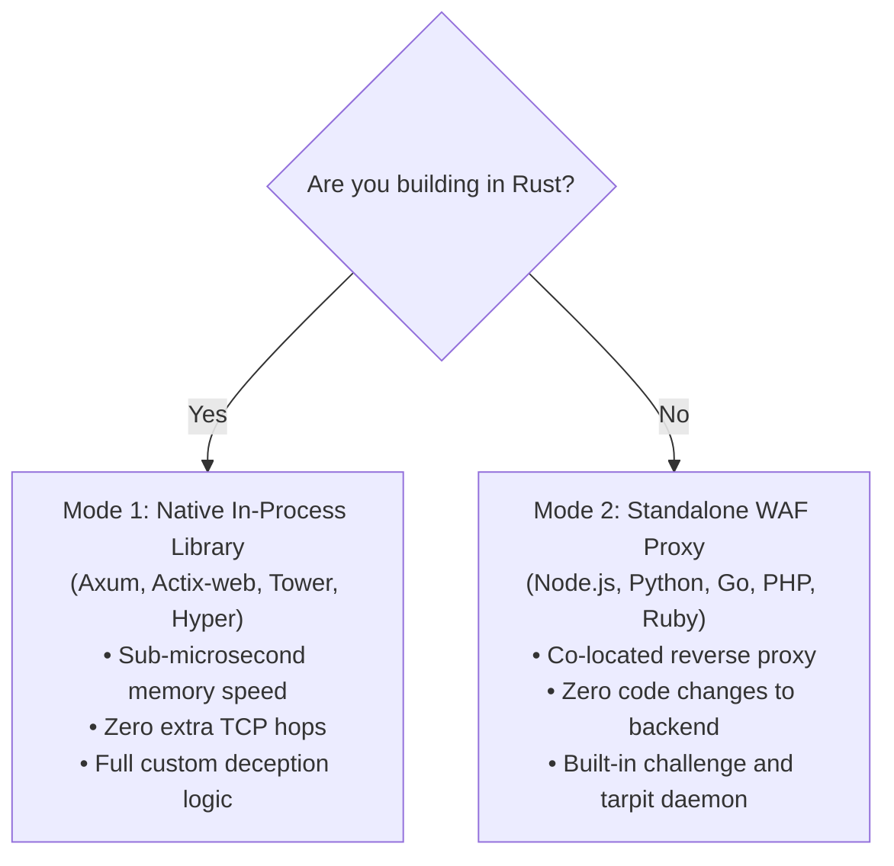

# Chapter 4: Integration & Framework Guide

> **Namespace:** `phylax::prelude`  
> **Previous:** [03: Case Study: Matrix WebRTC Mesh](03_CASE_STUDY_MATRIX_PRODUCTION.md) | **Next:** [05: Autonomous Abuse Intelligence](05_AUTONOMOUS_ABUSE_INTELLIGENCE.md)

---

## 1. Choosing Your Integration Mode

`phylax` supports two primary deployment topologies:



---

## 2. Mode 1: Native In-Process Rust Integration

### Adding Phylax to `Cargo.toml`

By default, `phylax` compiles with **zero external network dependencies** and zero telemetry:

```toml
[dependencies]
# Pure sovereign zero-telemetry defense
phylax = { git = "https://github.com/xuoxod/phylax.git" }

# Or opt into automated AbuseIPDB threat intelligence dispatch:
# phylax = { git = "https://github.com/xuoxod/phylax.git", features = ["abuse-reporting"] }
```

---

### Drop-in Axum Integration

```rust
use axum::{
    extract::{ConnectInfo, State},
    http::{HeaderMap, StatusCode},
    response::{IntoResponse, Response},
    routing::{get, post},
    Json, Router,
};
use phylax::prelude::*;
use std::net::SocketAddr;
use std::sync::Arc;
use std::time::{Duration, SystemTime, UNIX_EPOCH};

#[derive(Clone)]
pub struct AppState {
    pub phylax: Arc<PhylaxPipeline>,
}

#[tokio::main]
async fn main() {
    // 1. Build defensive pipeline with sub-microsecond fail-fast cost hierarchy
    let phylax = Arc::new(
        PhylaxPipeline::builder()
            .secret_key(b"your-cryptographic-master-salt-seed-2026")
            .with_honeypot_fields(["website_url", "company_fax"])
            .with_timing(1500, 600_000) // 1.5s human minimum, 10m ceiling
            .with_pow(12, 300_000)       // 12-bit micro-PoW puzzle
            .with_quarantine(QuarantineConfig::default())
            .with_adaptive_pow(AdaptivePowConfig::default())
            .build(),
    );

    // 2. Spawn autonomous in-memory hygiene worker (sweeps expired bans every 60s)
    let _hygiene_handle = phylax.spawn_background_maintenance(Duration::from_secs(60));

    let state = AppState { phylax };

    // 3. Mount routes and perimeter middleware
    let app = Router::new()
        .route("/api/shield/challenge", get(challenge_handler))
        .route("/api/auth/register", post(register_handler))
        .layer(axum::middleware::from_fn_with_state(
            state.clone(),
            perimeter_middleware,
        ))
        .with_state(state);

    let listener = tokio::net::TcpListener::bind("0.0.0.0:3000").await.unwrap();
    axum::serve(listener, app.into_make_service_with_connect_info::<SocketAddr>())
        .await
        .unwrap();
}

// Perimeter Middleware: Drops hostile subnets with plain 404 (Perimeter Ghosting)
async fn perimeter_middleware(
    State(state): State<AppState>,
    headers: HeaderMap,
    ConnectInfo(addr): ConnectInfo<SocketAddr>,
    req: axum::extract::Request,
    next: axum::middleware::Next,
) -> Response {
    let client_ip = extract_ip(&headers, addr);
    let shield_req = PhylaxRequest {
        client_ip: &client_ip,
        target_uri: Some(req.uri().path()),
        http_method: Some(req.method().as_str()),
        now_ms: current_time_ms(),
        ..Default::default()
    };

    if let PhylaxVerdict::Deny(_) = state.phylax.evaluate_perimeter(&shield_req) {
        return (StatusCode::NOT_FOUND, "404 Not Found\n").into_response();
    }

    next.run(req).await
}

// Challenge Handler: Issues timing token & PoW seed
async fn challenge_handler(
    State(state): State<AppState>,
    headers: HeaderMap,
    ConnectInfo(addr): ConnectInfo<SocketAddr>,
) -> impl IntoResponse {
    let client_ip = extract_ip(&headers, addr);
    let ctx = state.phylax.issue_client_context_for_ip(
        &client_ip,
        current_time_ms(),
        rand_nonce(),
    );
    Json(ctx)
}

fn extract_ip(headers: &HeaderMap, addr: SocketAddr) -> String {
    headers
        .get("x-forwarded-for")
        .and_then(|v| v.to_str().ok())
        .and_then(|s| s.split(',').next())
        .map(|s| s.trim().to_string())
        .unwrap_or_else(|| addr.ip().to_string())
}

fn current_time_ms() -> u64 {
    SystemTime::now().duration_since(UNIX_EPOCH).unwrap().as_millis() as u64
}

fn rand_nonce() -> u64 {
    current_time_ms().wrapping_mul(6364136223846793005)
}
```

---

## 3. Mode 2: Standalone WAF Proxy Daemon (Zero Rust Required)

If your backend is written in Python (FastAPI/Django), Node.js (Express/Nest), Go (Gin), PHP (Laravel/WordPress), or Ruby on Rails, run the compiled `phylax` binary as an edge reverse proxy:

```bash
# Start proxy in front of backend service running on port 8080
$ phylax serve --upstream http://127.0.0.1:8080 --listen 0.0.0.0:3000
```

### Production Configuration (`/etc/phylax/phylax.toml`)

```toml
[server]
upstream = "http://127.0.0.1:8080"
listen = "0.0.0.0:3000"
secret_key = "production-cryptographic-master-key-seed-2026"

[honeypot]
decoy_fields = ["website_url", "company_fax", "corporate_tax_id"]

[timing]
min_delta_ms = 1500     # Require at least 1.5s human dwell time
max_delta_ms = 600000   # 10 minute token validity ceiling

[pow]
baseline_difficulty = 12 # ~4,096 SHA-256 hashes (~5ms in browser)
ttl_ms = 300000          # 5 minute challenge validity

[quarantine]
infraction_threshold = 2
quarantine_duration_ms = 86400000 # 24 hour automatic CIDR ban

[tarpit]
enabled = true
max_concurrent_slots = 256
trickle_interval_ms = 3000
max_duration_secs = 45
```

---

## 4. Client-Side Frontend Integration: `client/phylax.js`

`phylax` includes a pure Vanilla JS frontend library (`client/phylax.js`) that automatically fetches challenge contexts, injects hidden honeypot fields, and solves micro-PoW puzzles without freezing the browser UI.

```html
<!-- 1. Include phylax.js -->
<script src="/static/phylax.js"></script>

<!-- 2. Standard HTML Form -->
<form id="signup-form" method="POST" action="/api/auth/register">
    <input type="text" name="username" placeholder="Username" required />
    <input type="email" name="email" placeholder="Email" required />
    <input type="password" name="password" placeholder="Password" required />
    
    <!-- Decoy fields are invisibly appended by Phylax -->
    <button type="submit">Create Account</button>
</form>

<script>
    // Automatically loads challenge and pre-computes PoW puzzle via requestIdleCallback
    Phylax.fetchChallenge('/api/shield/challenge');

    document.getElementById('signup-form').addEventListener('submit', function (e) {
        // Enriches payload with timing token and solved PoW nonce before transmission
        Phylax.enrichForm(this);
    });
</script>
```

---

## 5. Next Step

Learn how Phylax enables optional, automated reporting to global threat intelligence networks:

👉 **Continue to [Chapter 5: Autonomous Abuse Intelligence](05_AUTONOMOUS_ABUSE_INTELLIGENCE.md)**
