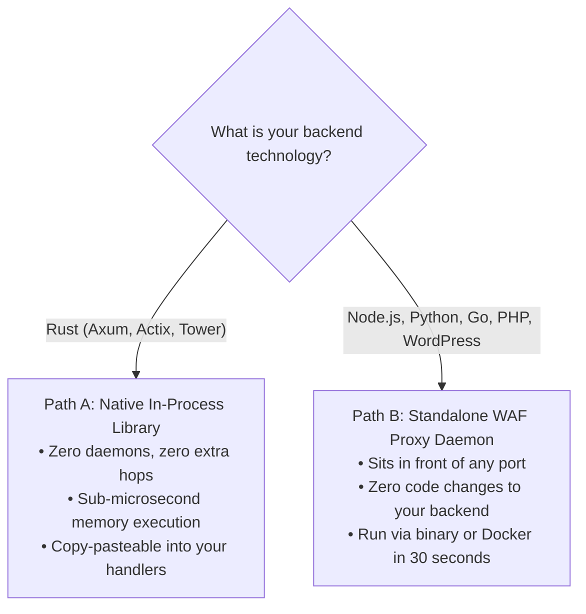

# Chapter 4: Integration & Framework Guide — 60-Second Foolproof Setup

> **Namespace:** `phylax::prelude`  
> **Previous:** [03: Case Study: Matrix WebRTC Mesh](03_CASE_STUDY_MATRIX_PRODUCTION.md) | **Next:** [05: Autonomous Abuse Intelligence](05_AUTONOMOUS_ABUSE_INTELLIGENCE.md)

---

## 1. Choosing Your Quickstart Path

Whether you're writing a new Rust web service or protecting an existing Node.js, Python, PHP, or Go backend, setup takes less than 3 minutes:



---

## 2. Path A: Native Rust Setup (Axum / Actix-web / Tower)

### Step 1: Add Dependency to `Cargo.toml`

By default, `phylax` compiles with **zero external network dependencies** and zero telemetry:

```toml
[dependencies]
phylax = { git = "https://github.com/xuoxod/phylax.git" }
```

*(Optional: If you have an AbuseIPDB API key and want automated reporting, use `features = ["abuse-reporting"]`)*.

---

### Step 2: The Complete, Copy-Pasteable Minimal `main.rs`

Here is a complete, self-contained Axum server you can paste directly into `src/main.rs`:

```rust
use axum::{
    extract::{ConnectInfo, State},
    http::{HeaderMap, StatusCode},
    response::{Html, IntoResponse, Response},
    routing::{get, post},
    Json, Router,
};
use phylax::prelude::*;
use serde::Deserialize;
use std::net::SocketAddr;
use std::sync::Arc;
use std::time::{Duration, SystemTime, UNIX_EPOCH};

#[derive(Clone)]
pub struct AppState {
    pub phylax: Arc<PhylaxPipeline>,
}

#[derive(Debug, Deserialize)]
pub struct RegisterPayload {
    pub username: String,
    pub email: String,
    pub password: String,
    // The honeypot decoy field: invisible to humans, irresistible to bots
    pub website_url: Option<String>,
}

#[tokio::main]
async fn main() {
    // 1. Initialize Phylax 12-layer defense pipeline in memory
    let phylax = Arc::new(
        PhylaxPipeline::builder()
            .secret_key(b"replace-with-a-random-secret-key-32bytes")
            .with_honeypot_fields(["website_url"])
            .with_timing(1500, 600_000) // 1.5s human minimum, 10 min window
            .with_pow(12, 300_000)       // 12-bit micro-PoW puzzle
            .with_quarantine(QuarantineConfig::default())
            .with_adaptive_pow(AdaptivePowConfig::default())
            .build(),
    );

    // 2. Spawn autonomous in-memory hygiene worker (cleans expired bans every 60s)
    let _hygiene_handle = phylax.spawn_background_maintenance(Duration::from_secs(60));

    let state = AppState { phylax };

    // 3. Mount routes and perimeter protection middleware
    let app = Router::new()
        .route("/", get(index_handler))
        .route("/api/auth/register", post(register_handler))
        .layer(axum::middleware::from_fn_with_state(
            state.clone(),
            perimeter_middleware,
        ))
        .with_state(state);

    let addr = SocketAddr::from(([127, 0, 0, 1], 3000));
    println!("🛡️ Phylax protected server running on http://{}", addr);
    let listener = tokio::net::TcpListener::bind(addr).await.unwrap();
    axum::serve(listener, app.into_make_service_with_connect_info::<SocketAddr>())
        .await
        .unwrap();
}

// Perimeter Middleware: Drops hostile subnets & quarantined IPs with generic 404
async fn perimeter_middleware(
    State(state): State<AppState>,
    headers: HeaderMap,
    ConnectInfo(addr): ConnectInfo<SocketAddr>,
    req: axum::extract::Request,
    next: axum::middleware::Next,
) -> Response {
    let client_ip = extract_ip(&headers, addr);
    let shield_req = PhylaxRequest {
        client_ip: &client_ip,
        target_uri: Some(req.uri().path()),
        http_method: Some(req.method().as_str()),
        now_ms: current_time_ms(),
        ..Default::default()
    };

    if let PhylaxVerdict::Deny(_) = state.phylax.evaluate_perimeter(&shield_req) {
        return (StatusCode::NOT_FOUND, "404 Not Found\n").into_response();
    }

    next.run(req).await
}

// Registration Handler: Deceptive Black Hole on honeypot infractions
async fn register_handler(
    State(state): State<AppState>,
    headers: HeaderMap,
    ConnectInfo(addr): ConnectInfo<SocketAddr>,
    Json(payload): Json<RegisterPayload>,
) -> impl IntoResponse {
    let client_ip = extract_ip(&headers, addr);

    // 1. Check Honeypot: Deceptive Black Hole
    if let Some(ref decoy) = payload.website_url {
        if !decoy.trim().is_empty() {
            println!("🚨 Bot trapped from IP: {}. Engaging black hole.", client_ip);

            // Record infraction in pipeline (quarantines IP and ratchets PoW)
            let trapped_fields = vec![("website_url".to_string(), decoy.clone())];
            let shield_req = PhylaxRequest {
                client_ip: &client_ip,
                submitted_fields: &trapped_fields,
                target_uri: Some("/api/auth/register"),
                http_method: Some("POST"),
                now_ms: current_time_ms(),
                ..Default::default()
            };
            let _ = state.phylax.evaluate_perimeter(&shield_req);

            // Return fake 201 Created. The bot thinks it succeeded and stops retrying.
            // Nothing touches the database, no welcome emails are dispatched.
            return (
                StatusCode::CREATED,
                Json(serde_json::json!({
                    "status": "SUCCESS",
                    "user_id": 0,
                    "uuid": "usr_stealth_trap",
                    "message": "Account created successfully."
                })),
            );
        }
    }

    // 2. Normal Legitimate Human User: Proceed with your registration logic
    println!("✅ Legitimate human registration: {}", payload.username);
    (
        StatusCode::CREATED,
        Json(serde_json::json!({
            "status": "SUCCESS",
            "user_id": 1001,
            "username": payload.username,
            "email": payload.email,
            "message": "Welcome aboard!"
        })),
    )
}

async fn index_handler() -> Html<&'static str> {
    Html("<h1>🛡️ Phylax Edge Defense Active</h1><p>Send POST /api/auth/register</p>")
}

fn extract_ip(headers: &HeaderMap, addr: SocketAddr) -> String {
    headers
        .get("x-forwarded-for")
        .and_then(|v| v.to_str().ok())
        .and_then(|s| s.split(',').next())
        .map(|s| s.trim().to_string())
        .unwrap_or_else(|| addr.ip().to_string())
}

fn current_time_ms() -> u64 {
    SystemTime::now().duration_since(UNIX_EPOCH).unwrap().as_millis() as u64
}
```

---

### Step 3: How to Render the Honeypot Field in HTML / CSS

Add this exact snippet to your HTML registration or contact form. Humans will never see it or be able to click or tab into it, but automated scrapers, headless browsers, and bot scripts will immediately populate it:

```html
<form method="POST" action="/api/auth/register">
    <!-- Standard visible human fields -->
    <label>Username: <input type="text" name="username" required /></label>
    <label>Email: <input type="email" name="email" required /></label>
    <label>Password: <input type="password" name="password" required /></label>

    <!-- 🍯 Honeypot Decoy Field (Hidden from humans via CSS & ARIA) -->
    <div style="position: absolute; left: -9999px; top: -9999px; opacity: 0; pointer-events: none;" tabindex="-1" aria-hidden="true">
        <label for="website_url">Leave this field empty</label>
        <input type="text" id="website_url" name="website_url" autocomplete="off" tabindex="-1" value="" />
    </div>

    <button type="submit">Sign Up</button>
</form>
```

---

## 3. Path B: Standalone WAF Reverse Proxy (Node.js, Python, PHP, Go, Ruby)

If you already have an application running (e.g. Node.js on `http://127.0.0.1:8080` or Python Django/FastAPI on `http://127.0.0.1:8000`), you don't have to touch a single line of your backend code.

### Option 1: Run via Cargo
```bash
# 1. Install Phylax CLI
cargo install --git https://github.com/xuoxod/phylax.git --features cli

# 2. Start the proxy in front of your service
phylax serve --upstream http://127.0.0.1:8080 --listen 0.0.0.0:3000
```

### Option 2: Run via Docker
```bash
docker run -d --name phylax-shield \
  -p 80:3000 \
  ghcr.io/xuoxod/phylax:latest \
  serve --upstream http://host.docker.internal:8080 --listen 0.0.0.0:3000
```

Now route your public traffic through port `3000` (or port `80`). Phylax will automatically filter bot attacks, rate limit malicious subnets, and reverse-proxy clean human requests to your application on port `8080`!

---

## 4. 3-Command Verification Checklist (cURL Tests)

Test and verify your defense in 30 seconds:

### Test 1: Legitimate Human Request
```bash
curl -i -X POST http://127.0.0.1:3000/api/auth/register \
     -H "Content-Type: application/json" \
     -d '{"username":"alice","email":"alice@example.com","password":"secretpassword"}'
```
**Expected Response:** `HTTP/1.1 201 Created` with `"message": "Welcome aboard!"`.

---

### Test 2: Bot Trips the Honeypot (Deceptive Black Hole)
```bash
curl -i -X POST http://127.0.0.1:3000/api/auth/register \
     -H "Content-Type: application/json" \
     -d '{"username":"bot_spammer","email":"spam@bot.com","password":"123","website_url":"http://spam-link.xyz"}'
```
**Expected Response:** `HTTP/1.1 201 Created` with `"uuid": "usr_stealth_trap"`.  
*(Notice: The bot thinks it succeeded, but your server printed `"Bot trapped from IP. Engaging black hole."` and no database writes occurred!)*

---

### Test 3: Perimeter Ghosting (Hostile / Quarantined Subnet)
```bash
curl -i http://127.0.0.1:3000/api/auth/register \
     -H "X-Forwarded-For: 185.220.101.5"
```
**Expected Response:** `HTTP/1.1 404 Not Found`.  
*(Notice: The server appears dead to automated scanners—zero mentions of firewalls or Phylax).*

---

## 5. Self-Service Troubleshooting & FAQ

#### Q: Do I need Redis, PostgreSQL, or any external database to run Phylax?
**A:** No. `phylax` is **100% in-process and memory-safe**. All rate limiting, CIDR routing, honeypot validation, and Bloom filter checks run directly in RAM using zero-allocation primitives.

#### Q: Do I need an AbuseIPDB account to use Phylax?
**A:** No. By default, `abuse-reporting` is completely disabled (`default = []`). Phylax executes pure zero-telemetry defense out of the box with zero external network requests. If you *do* want live AbuseIPDB reporting, simply enable the feature in `Cargo.toml` and set `ABUSEIPDB_API_KEY=your_key`.

#### Q: Will screen readers or autofill fill out the honeypot field?
**A:** No. Because the field uses `tabindex="-1"`, `aria-hidden="true"`, and `autocomplete="off"` with absolute out-of-bounds positioning, screen readers skip it, browser autofill ignores it, and human eyes cannot see it. Only automated headless bots and script scrapers interact with it.

#### Q: Can I run this in front of WordPress or WooCommerce?
**A:** Yes! Run `phylax serve --upstream http://127.0.0.1:80` and add your honeypot field names (e.g. `website_url`) to `/etc/phylax/phylax.toml`. Spambots submitting comments or fake registrations will be absorbed instantly.

#### Q: How much memory does Phylax consume?
**A:** Under standard production loads, the entire engine typically consumes **less than 12 MB of RAM**.

---

[← Return to Master Index](INDEX.md) | [Continue to Chapter 5: Autonomous Abuse Intelligence →](05_AUTONOMOUS_ABUSE_INTELLIGENCE.md)
