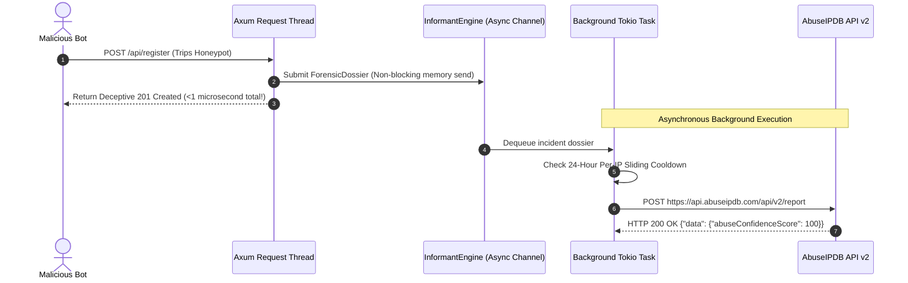

# Chapter 5: Autonomous Abuse Intelligence

> **Namespace:** `phylax::abuse_reporting`  
> **Feature Flag:** `abuse-reporting`  
> **Previous:** [04: Integration & Framework Guide](04_INTEGRATION_AND_FRAMEWORK_GUIDE.md) | **Next:** [06: Production Deployment & Runbook](06_PRODUCTION_DEPLOYMENT_AND_RUNBOOK.md)

---

## 1. Collaborative Edge Defense Without Data Leaks

While `phylax` is strictly **zero-telemetry by default**, enterprise edge operators often desire to participate in global threat intelligence networks to strike back at malicious botnets.

When a malicious bot trips an active honeypot trap, its IP address is confirmed hostile with **100% mathematical certainty** (since human users cannot see or populate invisible decoy fields).

The optional `abuse-reporting` module enables `phylax` to autonomously package forensic incident dossiers and report confirmed attackers directly to **AbuseIPDB v2** without human intervention.

---

## 2. Zero-Config Credential Discovery

To activate autonomous abuse reporting, enable the feature in `Cargo.toml`:

```toml
[dependencies]
phylax = { git = "https://github.com/xuoxod/phylax.git", features = ["abuse-reporting"] }
```

In your pipeline initialization:

```rust
let phylax = PhylaxPipeline::builder()
    .secret_key(b"your-secret-key")
    .with_default_abuse_reporting() // Automatically discovers API credentials
    .build();
```

`with_default_abuse_reporting()` searches for credentials in the following order:
1. **Environment Variable:** `ABUSEIPDB_API_KEY`
2. **Standard Host Reference File:** `~/Documents/reference/abuse_ip_db/api-key.txt`

If no valid API key is found, the informant engine safely disables itself without causing runtime panics or breaking edge request flow.

---

## 3. Asynchronous Non-Blocking Architecture

Reporting an abusive IP over HTTP involves DNS resolution, TLS handshake, and remote API round trips (100ms–500ms).

`phylax` executes reporting completely **out of band**:



**Request Thread Impact:** The calling Axum request thread incurs **< 1 microsecond** of overhead to clone the IP and push to the bounded channel before immediately returning the deceptive response.

---

## 4. Anti-Flood & Rate Quota Governors

To prevent an attacker from intentionally triggering honeypots to exhaust your AbuseIPDB daily quota, `phylax` enforces two layers of defense:

1. **24-Hour Sliding Window Per-IP Cooldown (`ReportCooldownGovernor`)**: Once an IP is reported, all subsequent infractions from that IP within 24 hours are absorbed silently without making remote API calls.
2. **Daily Quota Cap**: Enforces a strict maximum number of reports per 24-hour cycle (configurable, default: 1,000 reports/day).
3. **Private IP Filtering**: RFC1918 private subnets (`10.0.0.0/8`, `172.16.0.0/12`, `192.168.0.0/16`) and loopback addresses (`127.0.0.1`) are filtered out immediately.

---

## 5. XARF & AbuseIPDB Category Mapping

Reports generated by `phylax` are mapped to standardized categories:

| Infraction Type | AbuseIPDB Category ID | Category Name | Description |
|---|---|---|---|
| **Honeypot Decoy Trip** | `15` / `10` | *Hacking* / *Web Spam* | Automated crawler populated an invisible DOM trap. |
| **Credential Stuffing** | `18` | *Brute-Force* | High-velocity password testing detected by `CredentialGuard`. |
| **Relay Bandwidth Leeching** | `19` | *Bad Web Bot* | Unauthorized WebRTC TURN relay bandwidth leeching. |
| **Slowloris / L7 Starvation** | `4` | *DDoS Attack* | Persistent connection trickle detected by `StreamGuard`. |

---

## 6. Next Step

Deploy Phylax to production infrastructure with verified systemd units, Caddy reverse proxy configurations, and operational runbooks:

👉 **Continue to [Chapter 6: Production Deployment & Runbook](06_PRODUCTION_DEPLOYMENT_AND_RUNBOOK.md)**
