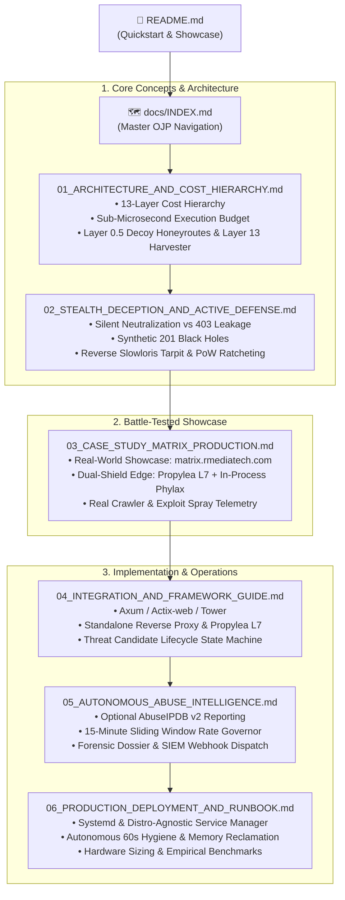

# Phylax Sovereign Edge Defense — Documentation & OJP Master Index

> **φύλαξ** (*phýlax* — ancient Greek for *"watcher, sentinel, guardian"*)  
> Sovereign 12-layer zero-telemetry edge defense, honeypot tarpit, and autonomous threat neutralization engine written in pure Rust.

Welcome to the **Phylax Optimal Journey Path (OJP)** documentation suite. This documentation is organized progressively—from fundamental architecture and core security paradigms to battle-tested production case studies, runnable integration guides, and operational runbooks.

---

## 🗺️ Optimal Journey Path (OJP) Sitemap

---

## 📚 Chapters Overview

| # | Chapter | Key Topics | Target Audience |
|---|---|---|---|
| **01** | [**Architecture & Cost Hierarchy**](01_ARCHITECTURE_AND_COST_HIERARCHY.md) | 13 defensive layers + Layer 0.5 decoy honeyroutes, Layer 13 emerging threat harvester, nanosecond Radix CIDR trees, Bloom filters, fail-fast cost hierarchy. | Architects, Security Engineers |
| **02** | [**Stealth Deception & Active Defense**](02_STEALTH_DECEPTION_AND_ACTIVE_DEFENSE.md) | Why 403 Forbidden leaks intel, Deceptive Black Holes (`201 Created`), login timing equalization, reverse Slowloris socket-hostage mode, quadratic PoW ratcheting. | Security Researchers, App Developers |
| **03** | [**Case Study: Matrix Real-Time WebRTC Mesh**](03_CASE_STUDY_MATRIX_PRODUCTION.md) | Battle-tested production deployment: [`matrix.rmediatech.com`](https://matrix.rmediatech.com). Dual-Shield edge topology with `propylea`, zero-latency WebRTC `TurnGuard`, real-world crawler telemetry. | Engineering Leads, CTOs |
| **04** | [**Integration & Framework Guide**](04_INTEGRATION_AND_FRAMEWORK_GUIDE.md) | 3 deployment paths: In-process Axum/Actix middleware, Propylea L7 reverse proxy gateway, standalone WAF daemon; frontend `phylax.js` helper. | Full-Stack Developers, SREs |
| **05** | [**Autonomous Abuse Intelligence**](05_AUTONOMOUS_ABUSE_INTELLIGENCE.md) | Non-blocking AbuseIPDB v2 reporting, multi-subnet forensic dossiers, per-IP sliding window token governors, zero-config credential discovery. | SecOps, Incident Responders |
| **06** | [**Production Deployment & Runbook**](06_PRODUCTION_DEPLOYMENT_AND_RUNBOOK.md) | Systemd units, distro-agnostic service script, autonomous 60s memory hygiene pass (`malloc_trim`), live traffic tuning, production epilogue. | Sysadmins, DevOps |

---

## 🏛️ Sovereign Defense Topology: Phylax vs. Propylea vs. Cloud WAF

| Defensive Dimension | `phylax` (Native Crate) | `propylea` (L7 Gateway) | Commercial Cloud WAF |
|---|---|---|---|
| **Placement Boundary** | In-Process inside Application | Public Edge Reverse Proxy | Third-Party External Network |
| **Evaluation Latency** | **`< 950 nanoseconds`** | **`< 15 microseconds`** | 20 ms – 80 ms (RTT jitter) |
| **Data Privacy** | **Zero Telemetry** (100% Sovereign) | **Zero Telemetry** (100% Sovereign) | Plaintext TLS decrypted externally |
| **Reconnaissance Countermeasure** | Stealth Deception & Black Holes | Stealth 404 & Active Decoy Traps | Explicit 403 / 429 (fingerprintable) |
| **Zero-Day Discovery** | Multi-Subnet Correlation (Layer 13) | Upstream 404 Feedback Loop | Manual signature / CVE patch delay |
| **Hostile Compute Burn** | Reverse Slowloris + Adaptive PoW | Early Edge Socket Drop | None (attacker burns your bill) |
| **Infrastructure Cost** | **$0** (Compiled in application) | **$0** (Standalone Rust binary) | Recurring monthly / bandwidth fees |

## 🚀 Quick Navigation Links

- **Main Repository Overview:** [`README.md`](../README.md)
- **Live Runnable Examples:**
  - Standard Axum Edge Defense: [`examples/axum_edge_defense.rs`](../examples/axum_edge_defense.rs)
  - Stealth Deception & Black Hole Defense: [`examples/stealth_edge_defense.rs`](../examples/stealth_edge_defense.rs)
  - Standalone Bloom Filter Inspection: [`examples/standalone_bloom.rs`](../examples/standalone_bloom.rs)
- **Security Policy:** [`SECURITY.md`](../SECURITY.md)
- **Contribution Guidelines:** [`CONTRIBUTING.md`](../CONTRIBUTING.md)
