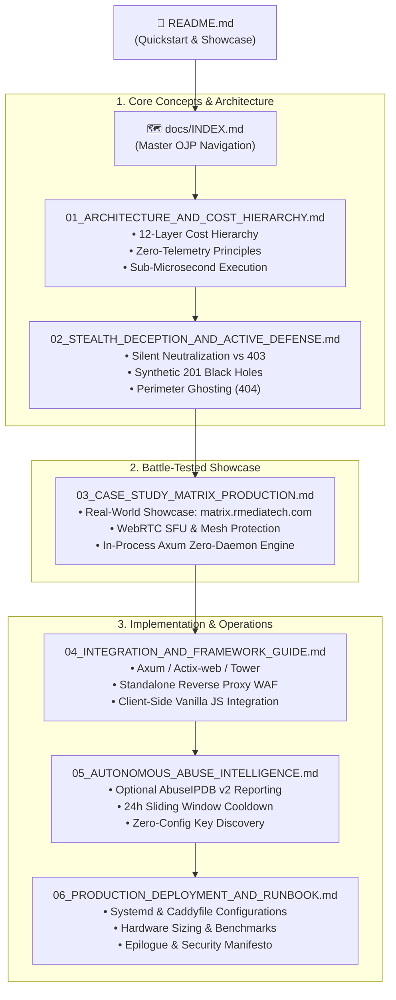

# Phylax Sovereign Edge Defense — Documentation & OJP Master Index

> **φύλαξ** (*phýlax* — ancient Greek for *"watcher, sentinel, guardian"*)  
> Sovereign 12-layer zero-telemetry edge defense, honeypot tarpit, and autonomous threat neutralization engine written in pure Rust.

Welcome to the **Phylax Optimal Journey Path (OJP)** documentation suite. This documentation is organized progressively—from fundamental architecture and core security paradigms to battle-tested production case studies, runnable integration guides, and operational runbooks.

---

## 🗺️ Optimal Journey Path (OJP) Sitemap

---

## 📚 Chapters Overview

| # | Chapter | Key Topics | Target Audience |
|---|---|---|---|
| **01** | [**Architecture & Cost Hierarchy**](01_ARCHITECTURE_AND_COST_HIERARCHY.md) | 12 defensive layers, nanosecond radix routing, Bloom filters, fail-fast mechanics, zero memory leaks. | Architects, Rust Developers |
| **02** | [**Stealth Deception & Active Defense**](02_STEALTH_DECEPTION_AND_ACTIVE_DEFENSE.md) | Why 403 Forbidden tips off attackers, Deceptive Black Holes (`201 Created`), generic `401` login masking, stealth `404` drops. | Security Engineers, App Developers |
| **03** | [**Case Study: Matrix Real-Time WebRTC Mesh**](03_CASE_STUDY_MATRIX_PRODUCTION.md) | First real-world production deployment: [`matrix.rmediatech.com`](https://matrix.rmediatech.com). Latency-free WebSockets, WebRTC `TurnGuard`, honeypot traps. | Engineering Leads, CTOs |
| **04** | [**Integration & Framework Guide**](04_INTEGRATION_AND_FRAMEWORK_GUIDE.md) | Drop-in Axum middleware, Actix-web examples, Standalone WAF Proxy for Python/Go/Node, frontend `phylax.js`. | Full-Stack Developers |
| **05** | [**Autonomous Abuse Intelligence**](05_AUTONOMOUS_ABUSE_INTELLIGENCE.md) | Non-blocking AbuseIPDB reporting, per-IP rate governors, XARF formatting, environment discovery. | SecOps, DevOps |
| **06** | [**Production Deployment & Runbook**](06_PRODUCTION_DEPLOYMENT_AND_RUNBOOK.md) | Systemd units, Caddy reverse proxy integration, log rotation, benchmark verification, epilogue. | Sysadmins, SREs |

---

## 🚀 Quick Navigation Links

- **Main Repository Overview:** [`README.md`](../README.md)
- **Live Runnable Examples:**
  - Standard Axum Edge Defense: [`examples/axum_edge_defense.rs`](../examples/axum_edge_defense.rs)
  - Stealth Deception & Black Hole Defense: [`examples/stealth_edge_defense.rs`](../examples/stealth_edge_defense.rs)
  - Standalone Bloom Filter Inspection: [`examples/standalone_bloom.rs`](../examples/standalone_bloom.rs)
- **Security Policy:** [`SECURITY.md`](../SECURITY.md)
- **Contribution Guidelines:** [`CONTRIBUTING.md`](../CONTRIBUTING.md)
